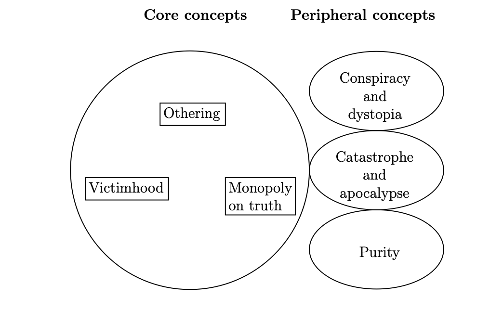
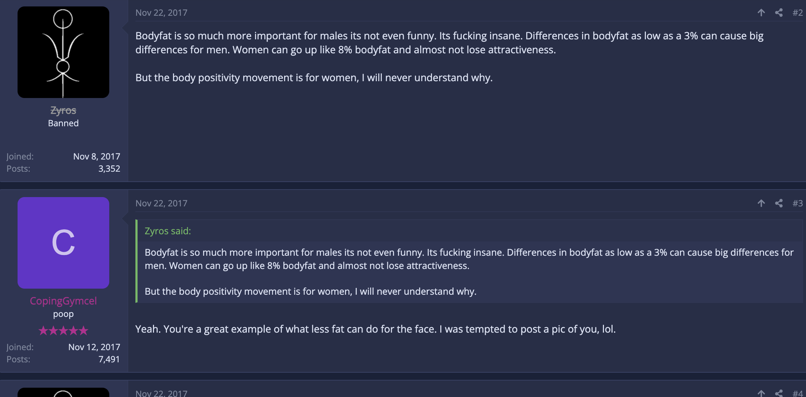
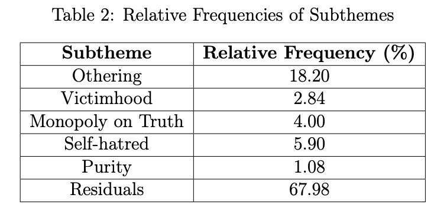
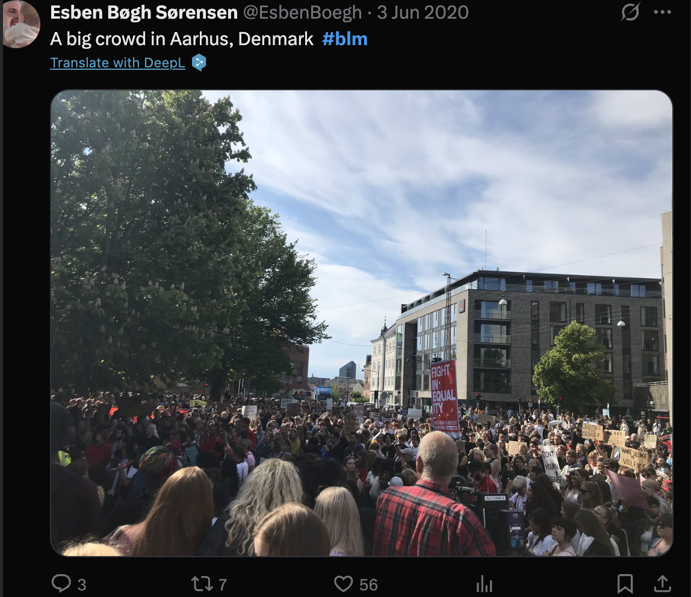
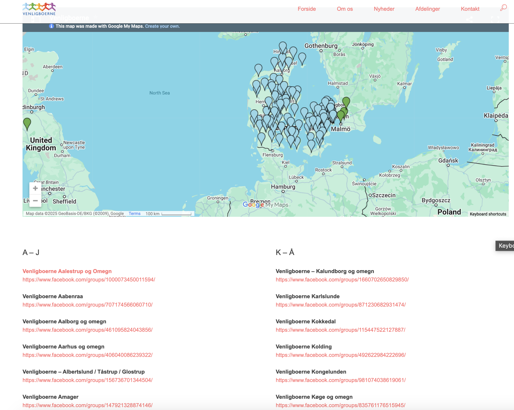
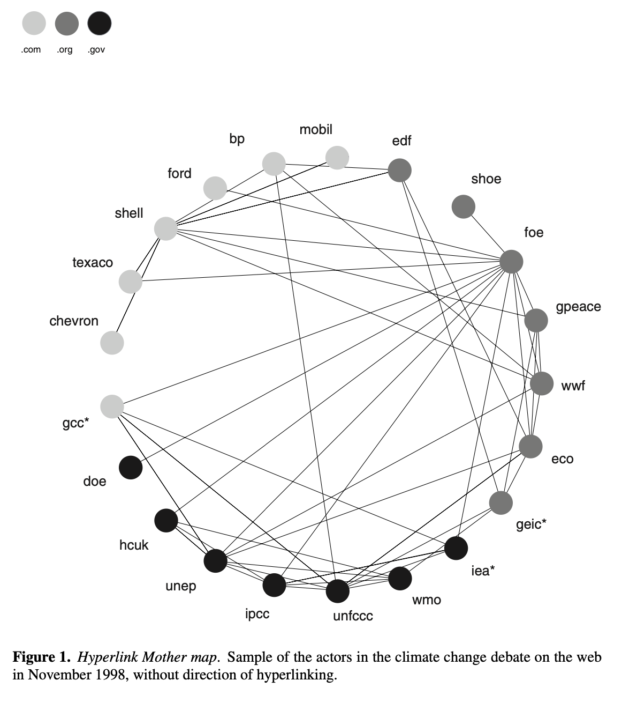
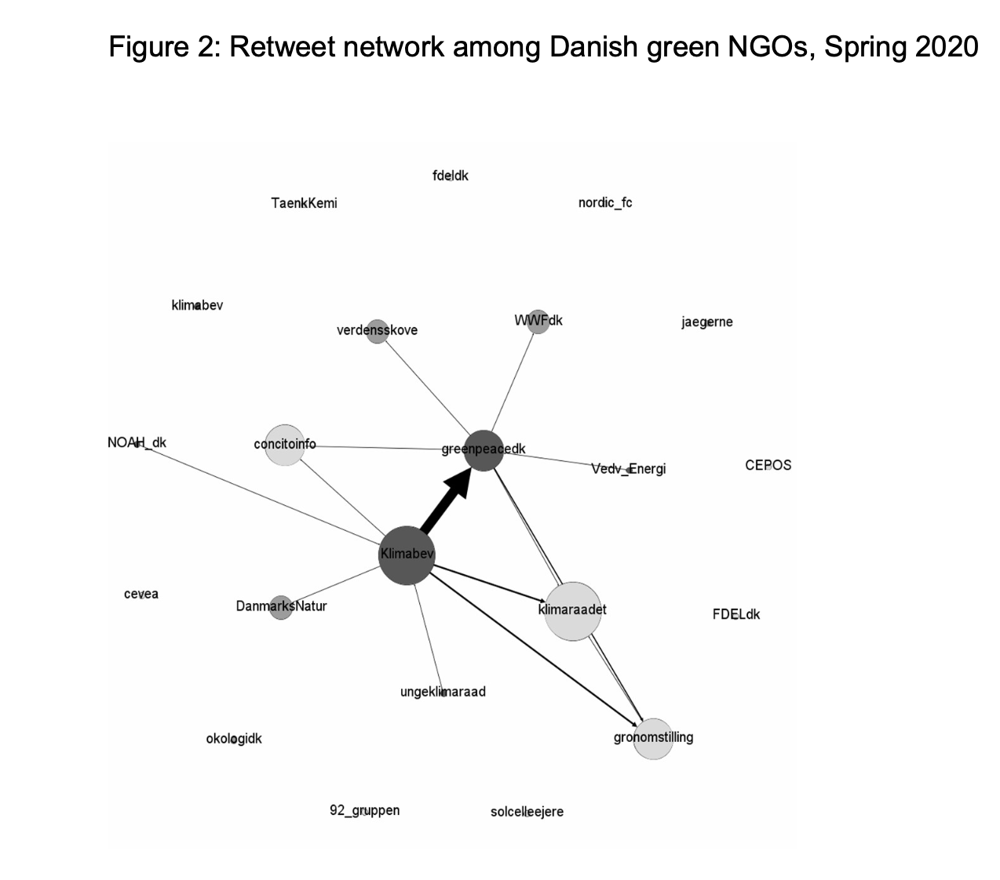
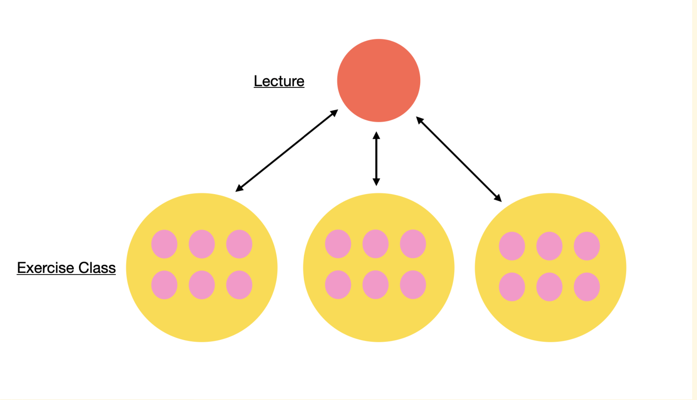

# The what, why and how of (mixed) digital methods

### Digital methods lecture 1
 
 
 
 
    Course responsible: Hjalmar Bang Carlsen, Associate Professor SODAS. hc@sodas.ku.dk
 
---

# Introduction to the teaching team 

- Julie Hvidsteen <hsl448@sodas.ku.dk>
- Csilla Duray <cd@plen.ku.dk>
- Mihaela Capriean <xbk406@sodas.ku.dk>
- Tereza Blazkova <tereza.blazkova@sodas.ku.dk>

---

# Overview of the lecture

1. Start with the end
2. What is (mixed) digital methods?
2. Why (mixed) digital methods?
3. How (mixed) digital methods?

---

# Let's Start with the End!

* Digital Mixed Methods Project of 25 pages
* Collect and use digital data to answer a self-chosen research question
* Applied both qual and quant analysis

---

#### Exam hand-in - **Focus**

*  digital mixed method research design 
*  netnography 
*  computer assisted qualitative text analysis
*  simple quantitative analysis
*  integration between qual and quant text analysis

---
#### Exam hand-in - **Must haves**

* A description of the datasite informed by netnography 
* A description of the data collection
* A description of the research design
* A qualitative text analysis, 
* A quantitative text analysis, 
* A computational classification must be validated using a manual coded test set 

--- 
#### Exam hand-in - **Prototype**

1. Introduction(1 page) 
2. Background: introducing topic and datasite(s)(1,5 pages)
3. Theory and literature.(2 pages) 
4. Design (1-2 pages)
5. Data collection (1-2 pages)
6. Methods(1-2 pages)
7. Analysis(6-8 pages)
8. conclusion(1-2 pages)

---

# Examples of last year projects

1. Incels and Extremism

2. How Ukrainian Military Brigades Mobilize Support Through Social Media

---

## Incels and Extremism: Research question

**Research question:** 
*What tenets in incel culture resemble the structure of extremist ideology?*  

**Conceptual focus:**

---

## Incels and Extremism: Datasite and Data collection

**Datasite**: 

**Data collection:**

---

## Incels and Extremism: Text analysis 

**Qualitative analysis:**
"*I am the worst of the worst. I don’t deserve to mate and breed. If a woman took pity and bore my offspring, it would destroy her life.*"________________________
In this case, his victimhood is not derived from previous rejections or his treatment by women in the past, but a self-deprecation he is placing upon himself. 

**Quantitative analysis:**

---
# What is *digital* methods?

 
**1.  In terms of data?**

**Repurposing of digital traces**

---
# What is digital methods?
 

 
1. In terms of data?
 
*Repurposing of digital traces*

---
 # What is digital methods?
 

 
1. In terms of data?
 
*Repurposing of digital traces*

**2. In terms of methods?**
 
**Learning from methods of the medium**

---

---

---

# What is digital methods?
 

 
1. In terms of data?
 
*Repurposing of digital traces*
 
2. In terms of methods?
 
*Learning from methods of the medium* 
 
**3. In terms of analysis?**
 
**Interpretative analysis of quantitative patterns**

---

**Network of Hyperlinks**

**Network of retweets**

---

# What is digital methods?

* a methodology that seeks **learn from methods of the medium**, that is the methods embedded in online devices. 
* The purpose is **not** to fine-tune them, this is better left to computer scientists.
* Yet, the goal is to use them to **investigate wider cultural dynamics**, while taking **medium specificity** seriously.

 
---
 
# What is *mixed* methods?
 

 
**1. In terms of data?**
 
**Combines qual(text) and quant(numbers) data**
 

---

# What is *mixed* methods?
 

 
1. In terms of data?
 
*Combines qual(text) and quant(numbers) data*
 
**2. In terms of methods?**
 
**Combines qual(interviews) and quant(surveys)**
 

---

# What is *mixed* methods?
 

 
1. In terms of data?
 
*Combines qual(text) and quant(numbers) data*
 
2. In terms of methods?
 
*Combines qual(interviews) and quant(surveys)* 
 
**3. In terms of analysis?**
 
**Interpretive AND analytical/statistical** 

---

# What is *mixed* methods?

- **mixed data-collection studies** those based on at least two kinds of data (such as field notes and administrative records) or two means of collecting them (such as interviewing and controlled experimentation). 

- **mixed data-analysis studies** those that, regardless of the number of data sources, either employ more than one analytical technique or cross techniques and types of data (such as using regression to analyze interview transcripts).

**Small 2011**

---
# What is *mixed digital* methods?

**1. In terms of data?** 

**Repurpose and combine qual and quant digital traces** 

---
# What is *mixed digital* methods?

1. In terms of data? 

Repurpose and combine qualitative and quantitative digital data 

**2. In terms of methods?**

**Combines qual(netnography) and quant(web-scraping)** 

---
# What is *mixed digital* methods?

1. In terms of data? 

Repurpose and combine qualitative and quantitative digital data 

2. In terms of methods?

Combines qual(netnography) and quant(web-scraping) 

**3. In terms of analysis?**
 
**Interpretive AND analytical/statistical(both comp assisted)** 

---
### Why Mixed digital methods?

 
**1. In terms of data**
* **qual in format and quant in scale**
* **Bad for qual, bad for quant, but good for mixed**
* **Digital data generated from specific socio-technical situations**

 
---

### Why Mixed digital methods?

 
1. In terms of data

Data is pretty mixed

**2. In terms of methods**

**Needs to be both contextual, flexible and scalable**
 
---

### Why Mixed digital methods?

 

 
1. In terms of data

Data is pretty mixed

2. In terms of method

Needs to be both contextual, flexible and scalable

3. **In terms of analysis**
  - **Quant and qual gets it wrong without being mixed** 
  - **Quant and qual gets lost without being mixed**

 
 
---
 
# How Mixed Digital Methods?
 
---

### Digital Methods course as a research collective

- The whole class as research a research collective studying interesting and important stuff using mixed digital methods

- Each exercise class as research cluster around certain topics, composed of multiple project groups doing their own independent research project.

---

---

### Exercise classes

* Groups will present one slide update every Tuesday(starting after Easter)
* Do a lot of group work
* Get feedback on the 4 Milestones
* Potentially do small exercises.  

---

### Supervision sessions

* 6 supervision sessions per group of 25 min each.
* Short update on the project and current challenges
* My office on the SODAS hallway

---

### Course outline

|  Lecture | Exercises  |
|---|---|
|  1. Research questions, research design, datasite| Get into groups, formulate a question, find datasites|
| 2. Data design, Data collection and Sampling  | Data collection  |
| 3. data exploration and open coding | Open coding session, data analysis design|
| 4. Computer assisted focused coding and text classification|focused coding session, codebook, data analysis design|
| 5. Text classification (continued) and Quantitative (text analysis) |Work on data analysis continued|
| 6. Mixed digital methods design of Analysis|Design Mixed Analysis, data analysis|
---

**The group-formation-and-topic-selection process**

* For those that need to form groups. Go to CSS 35-3-13. TAs Julie and Csilla will coordinate a group formation session. Use the google sheet to look for and note down topic of interest.

* For those in groups you will either go to 2-2-49(Tereza) or 2-2-55(Mihaela). Goal to find topic, research question and do initial scouting for data-sites. 

* You should have found group and topic by 16. April. We will make exercise classes of shared topical interest starting 22. April.

