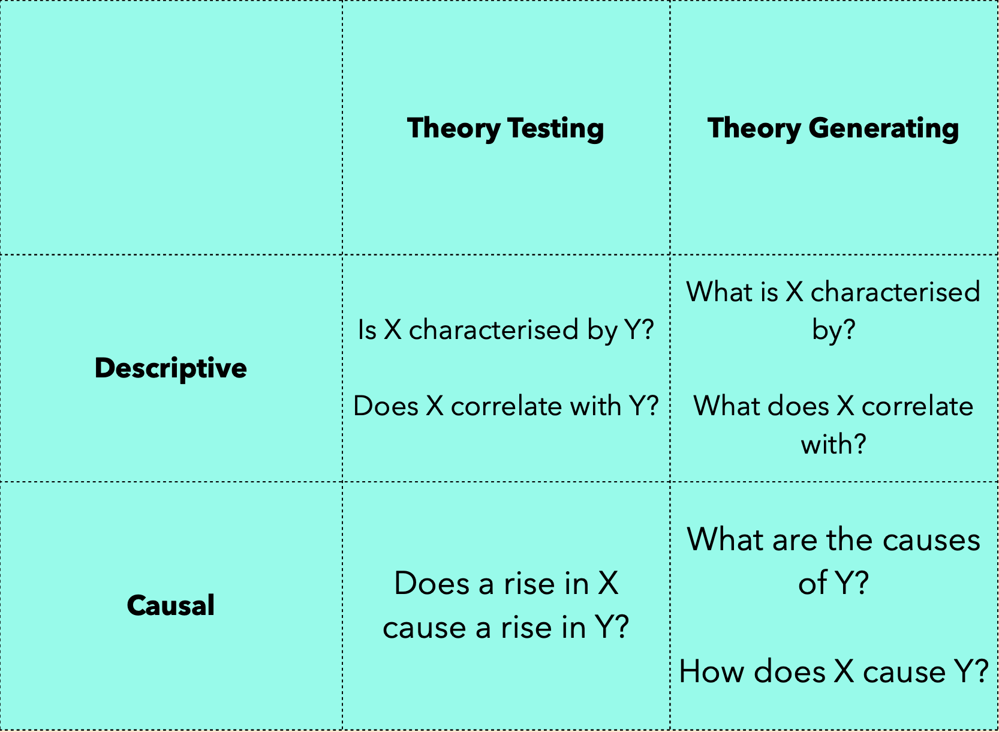
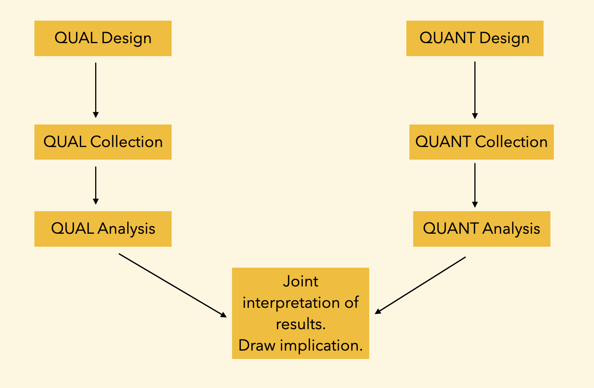
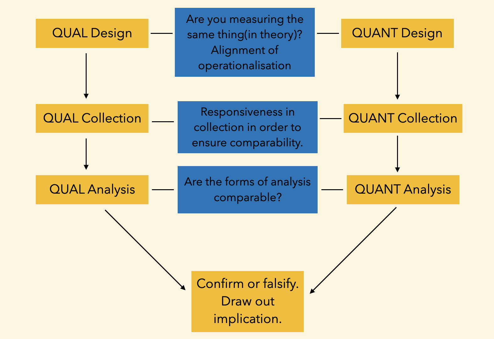
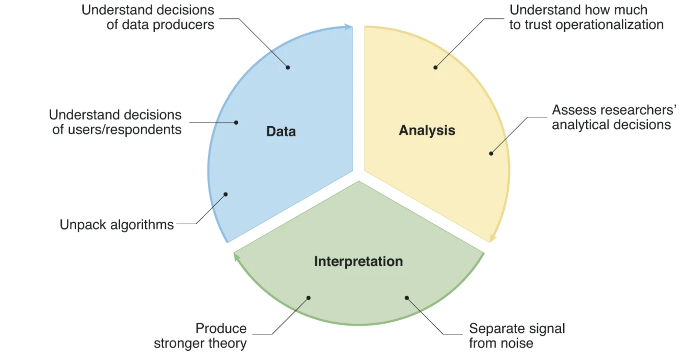
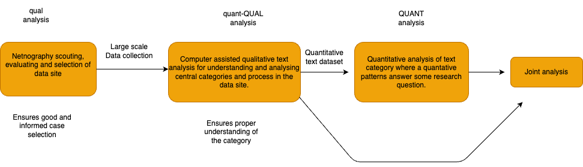

# Finding a Topic, Formulating a Research Question, and Thinking About a Design

### Digital Methods Lecture 2  
   
   
   
Course Responsible: Hjalmar Bang Carlsen, Associate Professor, SODAS. hc@sodas.ku.dk  

---

## Today's Tasks

1) Generate topics  
2) Formulate research questions  
3) Prototype a design to answer the research question  
    * The role of qualitative sub-studies

---

### What is a Topic?

- Simply a device to concentrate your attention on some things and not others.

- You can use heuristics to rearrange elements in order to view your topic from a new perspective.

---

## Topic Ideas, Please!

---

### What is a Topic?

- A broad theme  
- An event  
- A group  
- An activity  
- An idea/discourse  
- A technology  
- A location  

---

### Framing My Topic as X

* A broad theme  
* An event  
* A group  
* An activity  
* An idea/discourse  
* A technology  
* A location  

---

### Theoretical and Empirical Casing

* Some begin with a very empirical topic and need to conceptualize it.  
* Others start with a theoretical topic and need to approach it empirically.  

---

### Casing: What is an (Empirical) Topic a Case of?

* Casing — from an empirical to a theoretical case  
* Casing determines literature  
* Casing influences the relevant questions  

---

   
   
   

### What is X a Case of?

---

   
   
   

In groups, take either your case or another case proposed and translate it into 2 or 3 different theoretical cases.

---

### Case Selection: What Makes an Empirical Case Good for My Topic?

* Casing from a theoretical to an empirical case (case selection).  
* In the universe of possible cases, what is your case good or bad for?  
* Case selection has analytical consequences.  

---

### Coming Up with a Question  
   

  
   

---

### Some Questionable Rules for Questions

**General Rules:**

* You should be able to answer your question.  
* You should learn something after answering your question.  
* You should not know the answer beforehand.  
* Your first question formulation is not your final formulation.

---

### Some Questionable Rules for Questions

**Mixed Rules:**

* Some aspects of your question(s) need to be answerable with both quantitative and qualitative methods.  
* The same question can be answered using both qualitative and quantitative evidence.

---

### Types of Questions 1

* Theory-testing questions  
* Theory-generating questions  
* Descriptive questions  
* Causal questions  

---

---

### Questions and Quant/Qual

* Qualitative analysis can be causal AND theory-testing.  
* Quantitative analysis can be descriptive AND exploratory.

---

### Types of Questions 2

* What (character)  
* How (process)  
* Where (setting)  
* Why (causes/motivation)  
* Who (actors)  
* When (timing)  

---

## 🔍 What – Descriptive / Definitional Questions

**Purpose**: To identify, define, or categorize a phenomenon.

**Use when** you want to know what something is, characterize a phenomenon, or identify the types of things that exist.

**Examples**:
- What are the components of incel culture?  
- What frames do Ukrainian brigades use to mobilize support?  
- What deservingness evaluations do Ukrainian refugee volunteers use?

---

## 🛠️ How – Process / Mechanism Questions

**Purpose**: To understand processes, mechanisms, or how things work together.

**Use when** you're interested in dynamics, sequencing, or relationships.

**Examples**:
- How do volunteers coordinate efforts in refugee solidarity groups?  
- How do people with HIV navigate disclosure in daily life?

---

## 🌍 Where – Spatial / Contextual Questions

**Purpose**: To explore settings, locations, or spatial patterns.

**Use when** place, context, or institutional setting is relevant to your topic.

**Examples**:
- Where on Facebook do people discuss climate change?  
- Where in Denmark do we find place-based stigmatization?  
- Where in Denmark are there the most refugee solidarity groups?

---

## ❓ Why – Causal / Motivational Questions

**Purpose**: To explore reasons, causes, or motivations.

**Use when** you want to understand underlying forces or intentions.

**Examples**:
- Why do some volunteers stay active while others drop out?  
- Why is there a gender gap in political participation online?  
- Why do some users engage in hostile political commentary?

---

## 🧑 Who – Actor-Centric / Identity Questions

**Purpose**: To identify agents, actors, or social categories involved in a phenomenon.

**Use when** you're asking who is doing what, exploring social roles and identities, or examining the relative prevalence of actors.

**Examples**:
- Who participates in grassroots refugee support?  
- Who participates in politics on Facebook?  
- Who provides support in social networks?

---

## ⏰ When – Temporal / Timing Questions

**Purpose**: To explore the timing, duration, or historical emergence of phenomena.

**Use when** you're interested in sequences, timing, or change over time.

**Examples**:
- When are politicians responsive to social media feedback?  
- When did politicians adopt Facebook?  
- When did the concept of screen-time emerge in public discourse?

---

### Exploiting Digital Data and Mixed Methods for Productive Questions

 

1. **New data for testing "old" theories**

> "[J]ust as the invention of the telescope revolutionized the study of the heavens, so too the technological revolution in mobile, Web, and Internet communications has the potential to revolutionize our understanding of ourselves and how we interact." (Watts, 2012)

---

### Exploiting Digital Data and Mixed Methods for Productive Questions

 

1. New data for testing old theories  
2. **New data for theory generation**

"Induced data structures can surprise, challenging presumptions or pre-existing theory, and lead the social analyst to abductively generate new theory by imagining what would be socially required for those patterns to exist." (Evans & Aceves, 2016)

---

### Exploiting Digital Data and Mixed Methods for Productive Questions

 

1. New data for testing old theories  
2. New data for theory generation  
3. **Mixed digital methods for theory testing**

MM approaches help address the uncertainties of testing old theories with digital data.

---

### Exploiting Digital Data and Mixed Methods for Productive Questions

 

1. New data for testing old theories  
2. New data for theory generation  
3. Mixed digital methods for theory testing  
4. **Mixed digital methods for theory generation**

MM approaches support the discovery and grounding of your theories.

---

### Mixed Method Motives

   

   

---

---

### Mixed Method Motives

* Motivated by the specific research question/problem  
* Two overall justifications: confirmatory and complementary  
    * **Confirmatory** studies seek to confirm or reject findings through the use of different types of data and analysis  
    * **Complementary** studies use different data sources/analyses to answer different aspects of the research question.  

---

**Confirmatory Study Example**

* Discrimination in hiring

* Combine surveys (explicit attitudes) and audit studies (actual behavior)

---

**Complementary Study Example**

* Relation between institutional trust and activism

* Survey (quantitative correlation) and interviews (mechanisms)

---

#### From Confirmatory and Complementary Designs to Operations

1. **Confirmatory Operations** - confirm patterns found with one method using another  
2. **Complementary Operations** - use different methods to investigate different aspects.

---

#### Sequencing of the design

* Concurrent design
  * Different studies are independent of one another
* Sequential design
  * Different studies are dependent upon one another

---
**Con-**
**current**
**Design**

---
**Con-**
**current**
**Design**

---

**Sequential**
**Design**

---

---

#### What Role Does Qualitative Analysis Have in Social Data-Intensive Analysis?

   

---

### The Role of Qualitative Research in the **Data Generation** Phase

* Decisions that affect data production   
* Decisions made by respondents/users  
* The nature of algorithms  

---

### The Role of Qualitative Research in the **Analysis** Phase

* Linking variables to concepts  
* Analytical decisions  

---

### The Role of Qualitative Research in the **Interpretation** Phase

* From data to theory to data  
* Recognizing noise  

---

### Offline vs Online Grounding with Qualitative Methods

* Sometimes, we need to move beyond online data to properly ground our analysis  
* Many times, online observations provide a valuable resource for qualitative data  
* New mixed methods approaches allow moving between qualitative and quantitative data  
* Grigoropoulou & Small focus on the application of traditional qualitative methods  

---

#### Cool Aspects of Digital Text Data and Context Analysis

* **Computational methods assist qualitative analysis**  
    * Ensure saturation  
    * Guard against bias in qualitative analysis  
    * Enable discovery by alternative means  

* **Qual and Quant Analysis of the Same Observations**  
    * Ensure data integration  
    * Ensure analytical integration (scale qualitative categories)  
    * Allow us to revisit observations  

---

#### Sequential Analysis Design (Typical in This Course)

   
   

---

### Looking for Data Sites Over Easter?

* Start an immersion/research journal (this can be many different documents)  
* Search for relevant data sites (more than one)  
* Describe the relevant data sites in detail  
* Focus on the data sites' relevance to your topic and their ability to support a mixed digital methods research design (qual and quant).

---

**Exercise class**

* Focus on: Topics and research questions

* Where to be: Look in the google sheet!

---
 
 

### Next time: Find, evaluate and select datasite(s)

