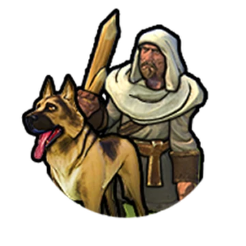

# Lecture 3 Finding, evaluating and selecting data site(s)

### Digital methods lecture 3
 
 
 
 
    Course responsible: Hjalmar Bang Carlsen, Associate Professor SODAS. hc@sodas.ku.dk
 
---

### Pick up from last time.

---

## Today's tasks

1. Find datasites
2. Evaluate data
3. Ethical evaluation
4. Start your immersion journal
5. Milestone
---

### From topic to datasite(s) OR how to find datasite(s)

---
### Investigation process
 
 
1) **Simplification**: translate research question/topic into search terms, and then

2) **Search operations** that return options for further explorations, that require

3) **Scouting operations** that provide initial observations on potential datasites.

4) **Evaluation** of datasites using data quality criteria.

5) **Selection** of datasite to become a part of the study.

6) **Collection** of data from the datasite

---

### **Simplification and Search**

Do not just put things into a search engine, think about how you can find a lead.  

1) Topical Words --> sites --> actors
2) Follow Topical Actors --> words --> sites  
3) Topical Platforms/places --> words --> actors
4) Ask a Chatbot

---

### Example Prepping
1) Device a search list:
  *  Device search terms that indicate prepping: (prepping,Survivalism, Emergency, preparedness, SHTF, Homesteading, Bugging out) - used a chatbot for this.
  * Compose list of words that indicate a social forum (forum, community aso)
2) Search combination of these + regional names
3) Do scouting of the return sites, update search terms
4) Return to step 2. 

---

### Prepping

* **Results:** 
  * many communities/forums, many relevant datasites
  * hard to find clearly identifiable actors

---

### How to Search?

1) Search engines(google aso)
2) Ask Chatbots(Chatgpt aso)

---
### Chatbot results

I asked: are there any social media sites dedicated towards prepping

* **Reddit:** r/preppers, r/survival, r/Survivalism 
  
* **YouTube channels:** Canadian Prepper, City Prepping, The Prepared Homestead

* **Forums:** SurvivalistBoards.com; PrepperForums.net; The Survival Podcast Forum

* Other sites: **MeWe** 

---

### Scouting 

--- 

### Scoutings two goals

1) scouting is exploration and learning. It is netnography in action.
  * "Seek deeper cultural understanding"
  * "emotional and intellectual engagement with your data sites"
  * "record the scouting expedition resulting from your search results in your immersion journal"

---
### 1. Scouting two goals

**1.** scouting is exploration and learning. It is netnography in action.

2) provides observations need to evaluate and select which data sites to choose 

---

**What is in the site?** 

1) **What** are people doing/talking about?
2) **Who** are the people active?
3) Is there any relational data/interaction?
4) Is there any digital traces of action beyond talk?
5) How much meta data is there on the site?

---

In groups take a data site and answer these questions

---

**The background of the datasite**

- What is the **purpose** of the site?
- Who **owns** the datasite?
- How does the datasite **function**?

---

**How does the datasite function?**

* How do you become a user? 
* How to you produce content?
* How do you consume content?(newsfeed, forum ect.)
* How do users interact?
* Is there content moderation?
* Who are the moderators?

---

# Evaluating data site(s)

---

### A reality checklist for digital methods

---
#### 1. Role of digital media in relation to object of study?

 

1) How much of your study object occurs in the medium that you are studying? 

2) Are you studying media traces for themselves or as proxies?

---

### 2. Definition of the study object 

"*Working with secondary data, you do not have the leisure to define your objects of study as you wish, but you are obliged to consider (at least in part) the way in which they are formatted by the technical and organisational standards of the medium.*" 

---

### 2. Definition of the study object 
 

1) Is your operationalisation attuned to the formats of the medium? *A retweet as an undirected social tie?*

2) Is your operationalisation attuned to the practices of the medium users? *#ahastagwithoutanytopicreferentjustmessyingaround*

---
### 2. Definition of the study object 

1) Tensions between **theoretical relevant** VS **medium** and **practice** attuned 

2) Too much focus on theoretical relevance risks **mismatch between theory and data**

3) Too much focus on being practice and medium attuned risks **being irrelevant** 

4) Using **heuristics** to creatively **solve the tension**(example mobilized public opinion)

---
### 3. From single-platform to cross-platform analysis 

1) Does the phenomenon that you are studying spill across several media? *Is this actually happing on insta?*

2) Have you different but comparable operationalisations, for the different media? *Facebook comment the same as twitter comment?*

---
### 4. Corpus demarcation and data access 

1) What does your corpus represent? *Within datasite sampling*

2) Are you accounting for the ways in which data are ‘given’ by the media? *API and webpages all provide information a specific way for specific reasons*

---

In groups choice and answer one or two of Venturini et al's questions: 

- How much of your study object occurs in the medium that you are studying? 
- Are you studying media traces for themselves or as proxies?
- Is your operationalisation attuned to the formats of the medium? 
- Is your operationalisation attuned to the practices of the medium users?
- Does the phenomenon that you are studying spill across several media?

---
### **Quality** criteria for the **datasites**

1) Relevance
2) Activity
3) Interactivity
4) Diversity
5) Richness

---

In groups discuss and evaluate your datasite(s) in relation to one more or more of datasite quality criteria: relevance, activity, interactivity, diversity, richness.

---
### **Quality** criteria for **data**

1) Text data: *Depth, variance, context* 

2) Relational data: *strength, obligations, endurance, coverage*

3) Actor data: *relevant background information, functional role, in-depth description, trustworthiness, coverage.*

4) Activity data: *meaningful, temporal information, cost, context* 

---

In groups take your central concept and it's data trace, evaluate your data trace given its datatype and its relation to your central concept.

---
### **Ethics** in mixed methods digital research

---
### **Ethical** considerations at different stages 

1. Research question

2. Data selection and collection 

3. Data storage and security

4. Interpretation and analysis

5. Reporting and representation

---
### **Ethical** considerations in data selection and collection

- Private or public datasite?

- Informational expectations?

- Explicit no-research-statement?

- Sensitive topic?

- Vulnerable population? 

---

---

In groups discuss ethics in relation to your data collection. What are the most important troubles and concerns? Try to run through the ethics flowchart. What concerns arise?

---

### Immersion journal

The book, document, spread sheet that you systematically use during your research. 

1) **Record** your observations 
2) **Research** put them in relationship to your research question
3) **Reflect** upon your own reactions, feelings and interpretations

---

### Immersion journal - how to

1) Set time aside for immersion systematically
2) Organize your notes: Link, content, your-description, key words
3) A document template for each observational task: datasite evaluations and selection, actor analysis, temporal analysis

---
### Milestone 1

1) Description and justification of research topic
and question

2) Description and justification for central
datasite(s)
(assignment 1, 1-2 pages – hand in to your TA
25/4 at 23.59)

---
 
 

### Next time: Data collection and sampling!

