

# Lecture 4 Data collection and sampling 

### Digital methods lecture 4
 
 
 
 
    Course responsible: Hjalmar Bang Carlsen, Associate Professor SODAS. hc@sodas.ku.dk
 
---

### Pick up from last time.

---

### Today's tasks

1. Data design
2. Data sampling
3. Data collection

---

### Data Integration

*Concerns how different forms of data relate to one another.* 

- Integrated
- Nested/Hierarchical
- Transformation

---

### **Integrated** data Integration

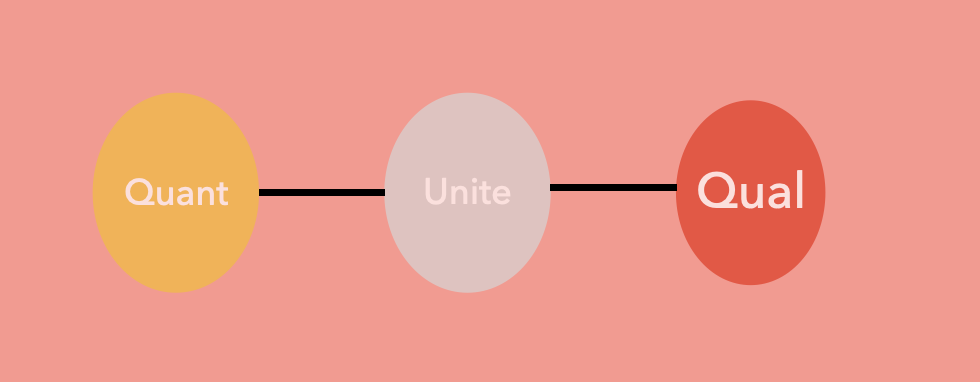

---

### **Integrated** data Integration

* Definition: different types of data on the same unit of observation.
* Classical example: survey data and interview data on the same individual
* Digital example: text data and feedback data on social media post
* Strength: allows validation, strong data link, strong analytical integration. 

---
### **Hierarchical** data integration

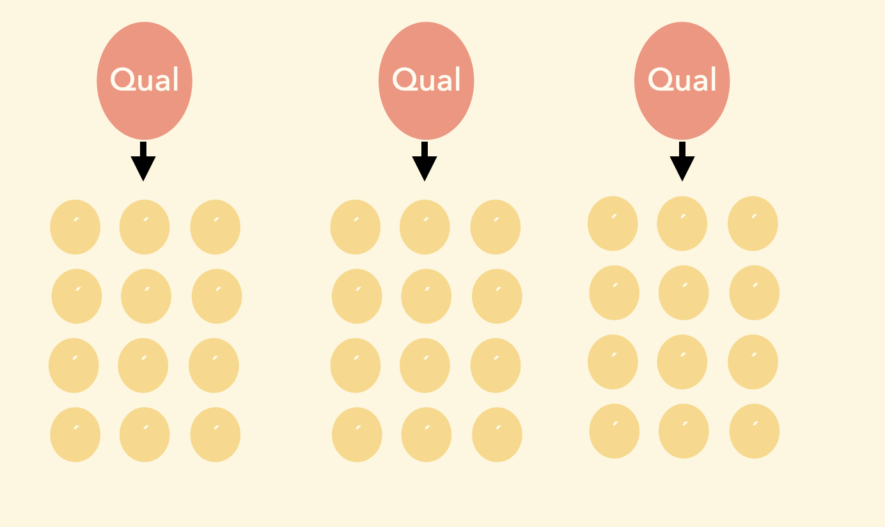

---
### **Hierarchical/Nested** data integration
* Definition: A larger unit that contains many smaller units
* Classical example: School (big unit) containing students (small unit)
* Digi example: Social media group containing social media users
* Trick: Use qual analysis of small N-larger unit to measure a context variable amongst large N-smaller unit
* Strength(low-cost, qual driven) AND Weakness(unsure relation)

---
### Data **transformation**

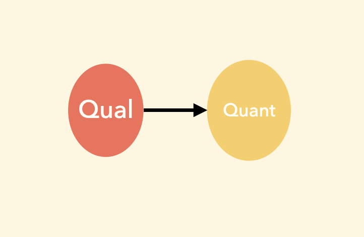

---
### Data **transformation**

* Definition: Transform qual data to quant data through analytical procedure
* Classical example: label text data(qual) to get a count variable(quant)
* Digi example: use computational methods to label text to get a count variable
* Strength: strong analytical and data integration, low-cost data collection

---

#### In groups discuss which type of data integration is used in your project. 

---
### Data collection design in mixed methods
---
### Motivation for different data types

- Complementary: different data to analyse different aspects

- Confirmatory: analyse the same aspect using different data 

---
#### **Concurrent** design

---
#### **Concurrent** confirmatory design

---
#### **Concurrent** complementary design

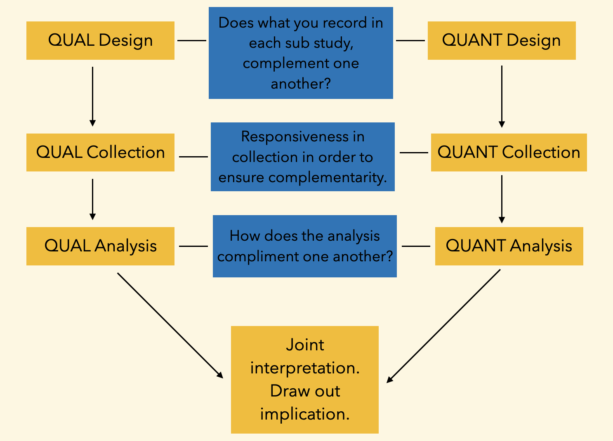

--- 
#### **Sequential** design

---
#### **Sequential** design

---

#### **Sequential** digital method design

--- 
#### **Dependencies** in mixed data collection

1) Quant data collection is dependent upon qual data collection and analysis(netnography determining datasite)

2) Qual data analysis dependent on large scale data collection(computer assisted data analysis)

3) Quantitative data transformation is dependent upon qualitative text analysis

    
---
#### Sampling **ideal**

1) Random sample 
2) Full sample
3) Fair sample
4) A Good Case 
5) Large Sample
6) Transparent and systematic sample

---

#### Mixed sampling ideals

1) Qual whats to learn from concrete instances, many relevant observations

2) Quant wants to learn about a distribution, sampling procedure can't determine distribution

3) A good qual sampling strategy can be a bad quant sampling strategy and a good quant can be a useless qual strategy.

4) Your goal device a sampling strategy both good for quant and qual.

---

#### Sampling **types** on social media

1) Actor based sample(*actor characteristic*)
2) Topic based sample(*topical content*)
3) Location based sampling(*specific places*)
4) Mixed sampling(*combination of above*)

---

#### Together in groups discuss the most your sampling strategy and the important sampling problems related to your project.

---

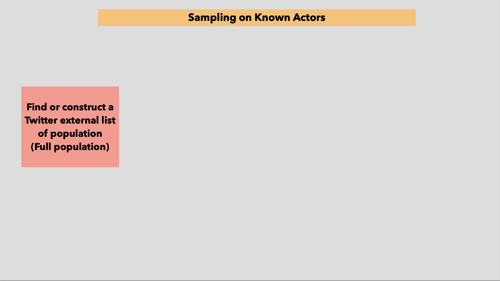

--- 

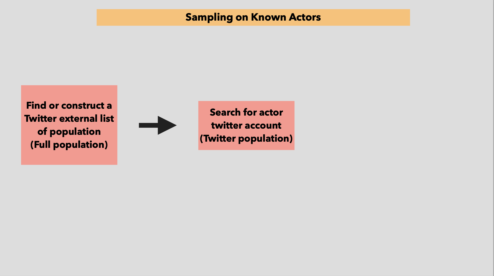

---

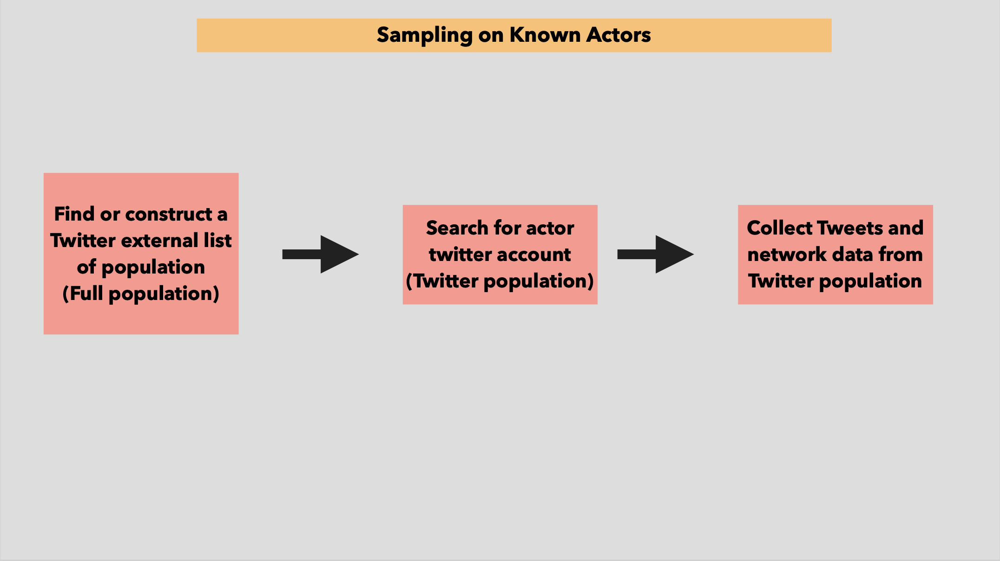

---

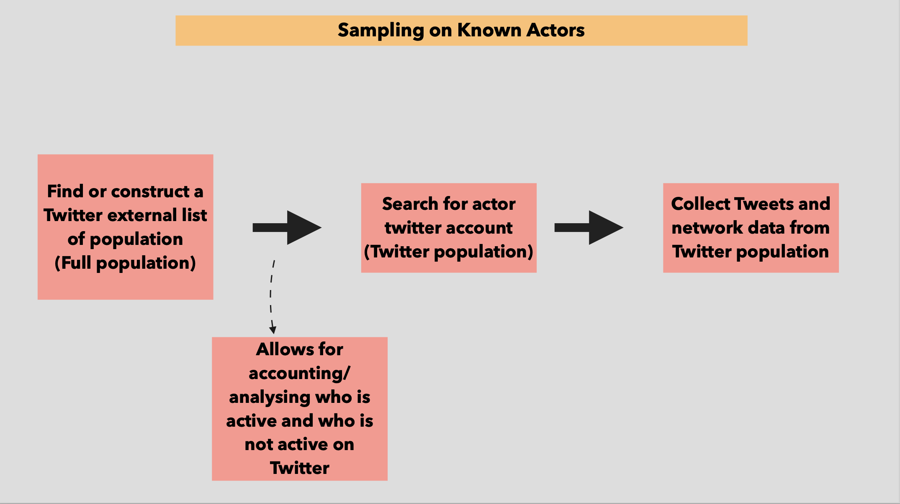

---

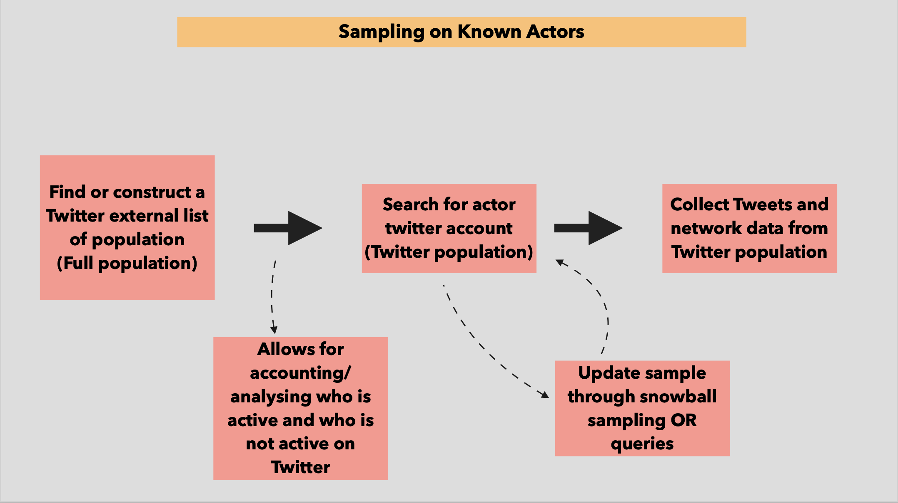

---

#### **Snowball** sampling for uncovering unknown actors

1) logic: use the social relations of actors to find new actors
2) why: to find hidden population(unknown populations), No sampling frame
3) classical: respondents tell you whom to contact next
4) digi version: relational traces tell you where to do next
5) digital traces provide low-cost traces that can automatically be followed, but also provides low-quality data that needs to be qualified.
6) Snowball sampling relies on the principle of homophily, which can also bias your sample

--- 

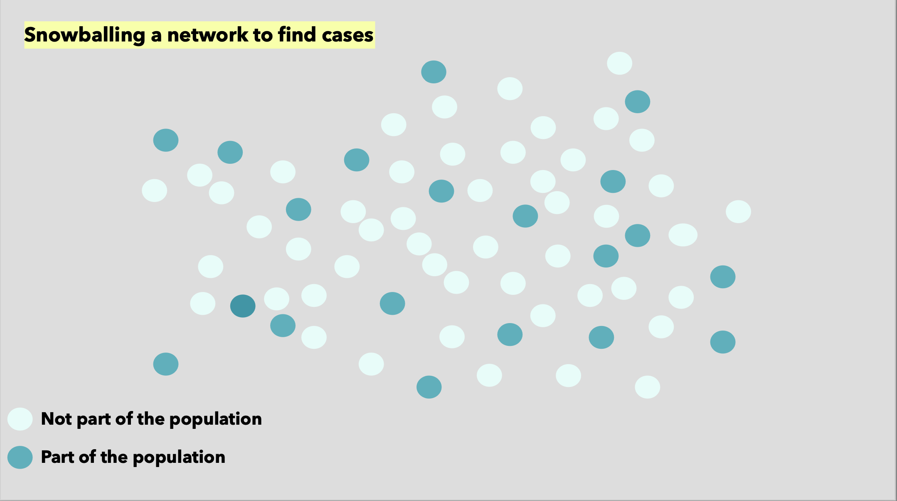

---

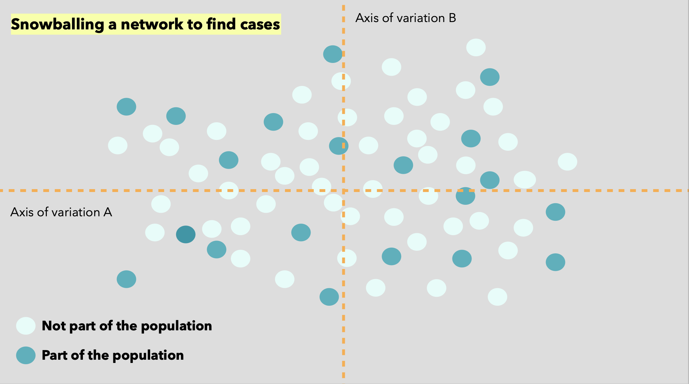

---

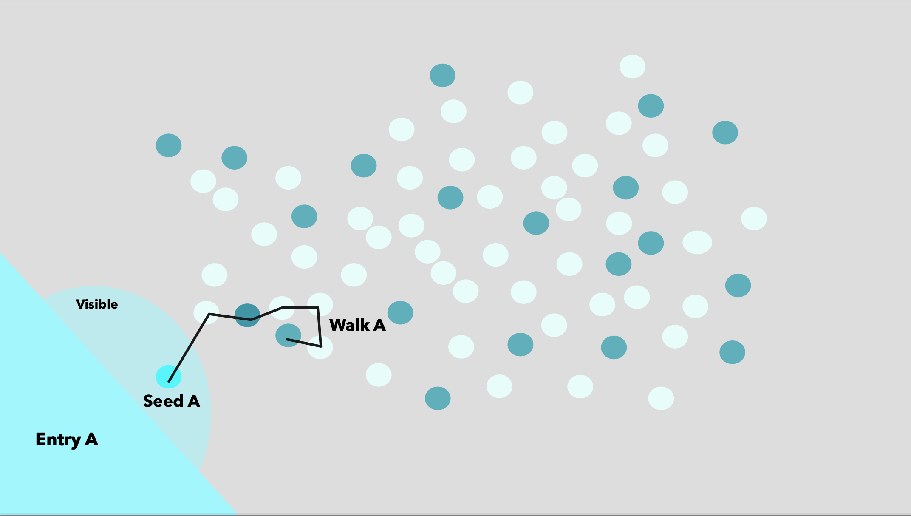

---

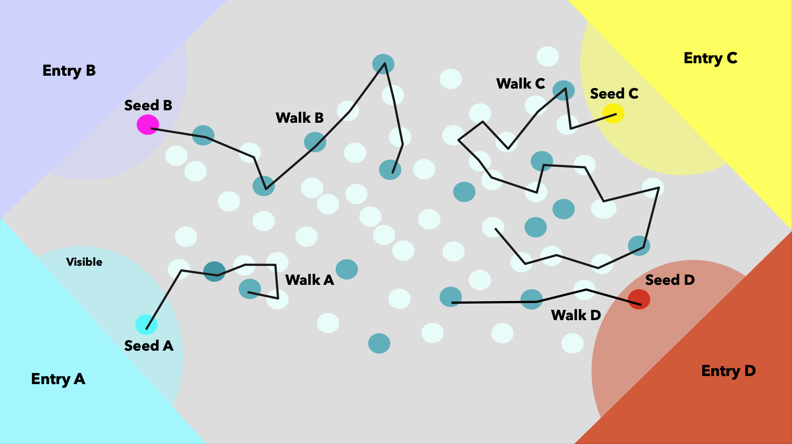

---

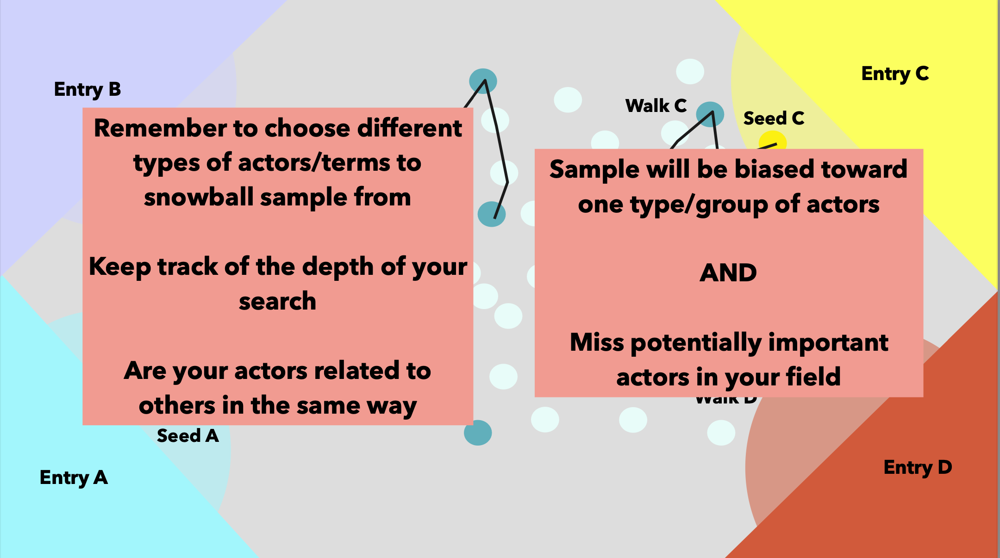

---

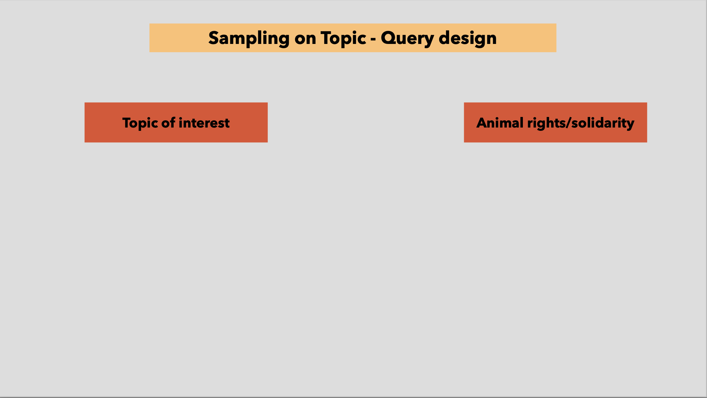

---

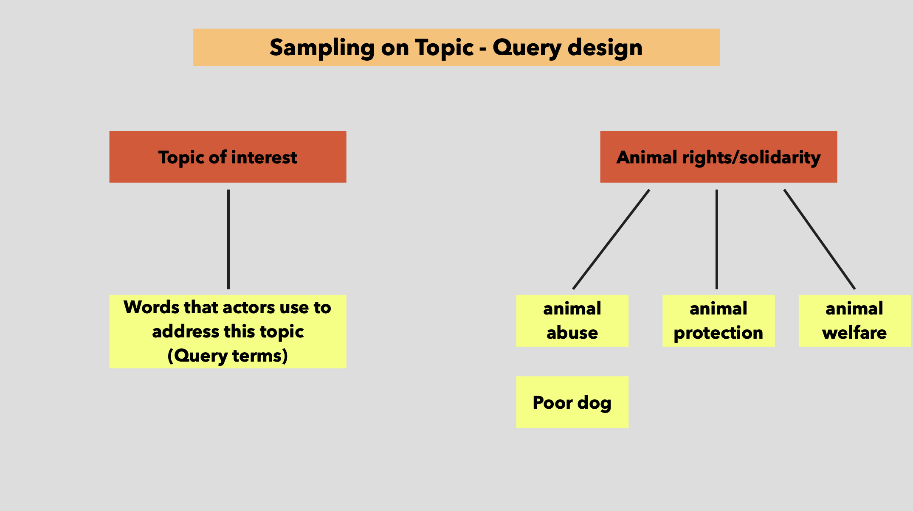

---

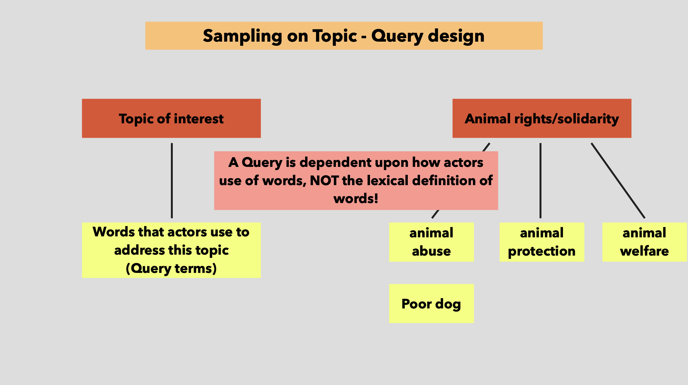

---

#### Topic sampling AND topic analysis! OBS

1. sampling on a topic makes topic analysis hard
2. The variation you observe is likely due to your query words. 
3. If you do not have full sample it might be better with a fair sample: where any given topic is equally likely to occur given query terms.  

---
#### Topic sampling through sub-forums

1) In some cases you might choose sample a specific sub-section of your site. 

2) Importantly here you are relying on sites definitions and users behaviors

3) Within topic variation focus

4) Know how your subsections relates to other parts of your datasite.

---

#### Locating Support Groups on Social Media

1. sample target: near full sample of ukraine refugee support groups on Facebook in Denmark
2. Data collection: Collect group information data and within-group interaction
3. Goal: to study within group interaction, support giving, political discussions, coordination
4. challenge: unknown population no sampling frame.
___

|   Table 1. Procedure for group sampling and basic description  |                                                                                                                                                                                             |                                                                                                                                                |                                                                                                                              |                                                                                                                                     |
|----------------------------------------------------------------|---------------------------------------------------------------------------------------------------------------------------------------------------------------------------------------------|------------------------------------------------------------------------------------------------------------------------------------------------|------------------------------------------------------------------------------------------------------------------------------|-------------------------------------------------------------------------------------------------------------------------------------|
|   Steps                                                        |   Step 1: **Extensive group search**                                                                                                                                                            |   Step 2: **Group selection**                                                                                                                      |   Step 3: Retrieve metadata                                                                                                  |   Step 4: Code groups                                                                                                               |
|   General description of procedure                             |   Use social media search for both a general query targeting national groups and a location specific query targeting local groups.                                                          |   The full list of groups returned by the extensive groups search is manually checked to ensure that the groups fall within the sample frame.  |   Facebook groups contain metadata which can be used to construct variables.                                                 |   Location of group, group purpose, group rules and more.                                                                           |
|   Goal                                                         |   **High recall**                                                                                                                                                                               |   **High precision**                                                                                                                               |   Information for variable construction                                                                                      |   Theoretical relevant variables                                                                                                    |
|   Specific procedure                                           |   Our query was “ukraine hjælp”(ukraine help), our locational query was “[location]” (going through a full list of names of Danish locations) + “ukraine” producing 581 different queries.  |   We read the group description and selected those which aimed to provide practical support or expressed solidarity with ukrainians.           |   Retrieved group's number of members, amount of recent activity, group name, groups description and public/private status.  |   In our case we inferred the location of the group from the title of groups, the group purpose and rules (last two not reported).  |
|   Result                                                       |   A list of  over 800 unique groups from the general and locational search.                                                                                                                 |   128 groups were classified as Ukraine solidarity groups. 60 of these are tied to a location.                                                 |   A dataset with the variables specified above. We removed all groups not active within the last month.                      |   A dataset with the variables specified above + those identified in step 3.                                                        |

---
#### Collecting All Danish Facebook Pages
 

1. Gathered an extensive seed of local and national Danish Facebook pages. 
2. Snowball sampled millions of Facebook pages around the world. 
3. Selected the Page that wrote in Danish and collected activity data using the API.

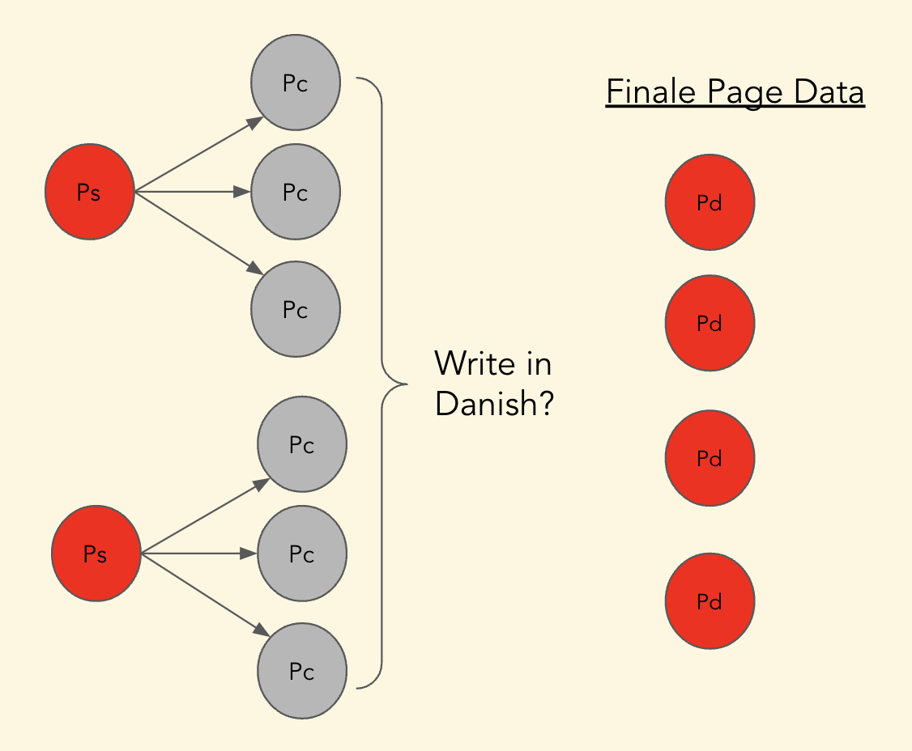

---

#### Sampling considerations

1) Interested in **theme/topic** (*enough instances to learn from and yet not determine the thematic/topical distribution*)
2) Interested in **temporal change**(*ensure comparable, fair and controlled sample over time*)

---

#### Collection through API

1) Read the documentation
2) Design your data collection to most effectively exploit the possibilities in the API 
3) Test in small scale
4) Monitor data collection
5) Validate data collection
6) Consider rate limit!

---
#### Data collection webscraping

1) get to know the site well: source code and build up. 
2) look for lists that make collection easy
3) test in small scale
4) monitor data collection
5) validate data collection 
6) No DOS attacks!
7) If you need to do somethings manually - do it manually.

---
  
#### What are important features of the large-scale data

1) Does your data have open text field? 
2) Does your text data have scale?
3) Does it have metadata that allows for quantitative analysis

---

### Next time 
