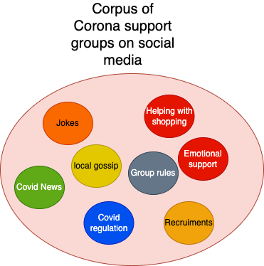
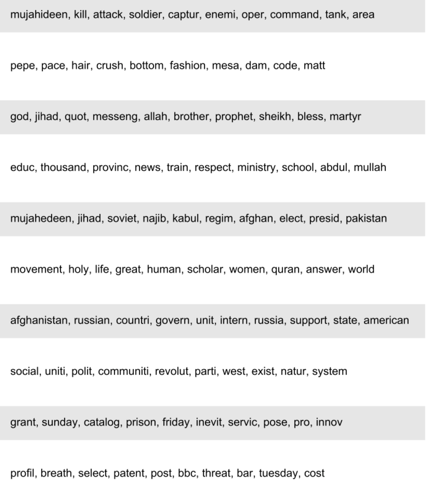
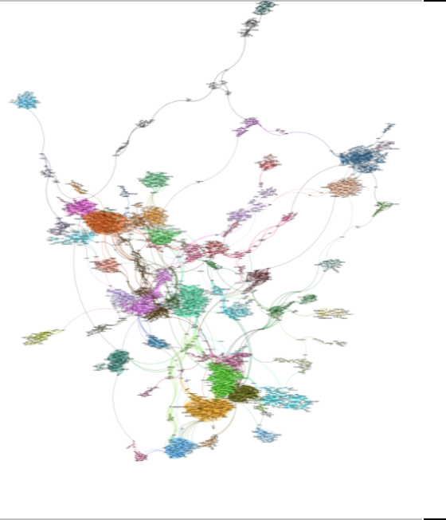
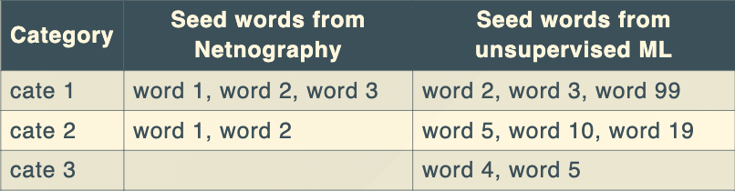
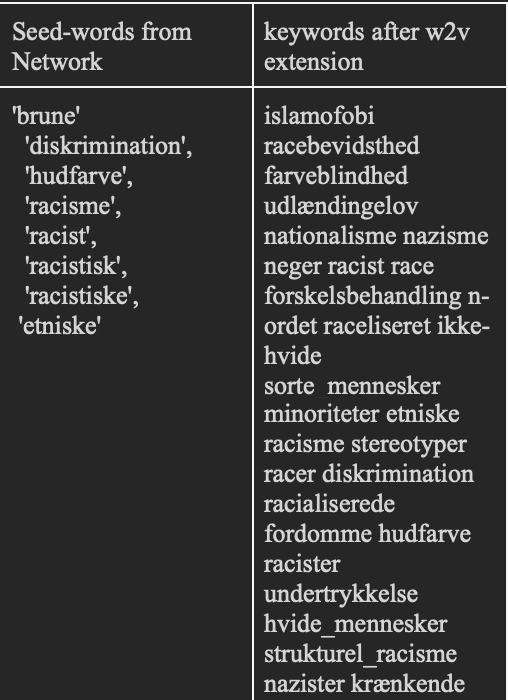

# Computer assisted discovery and open coding

### Digital methods
 
 
 
 
    Course responsible: Hjalmar Bang Carlsen, Associate Professor SODAS. hc@sodas.ku.dk
 
---

#### Today's Tasks

1. Introduce the computer assisted framework for content analysis
2. Computer assisted discovery of text categories
3. Open coding
4. In class open coding session. 
5. In class illustration of the workflow

---
 
 
 

#### Introduction to the computer assisted framework for content analysis - Discovery and open coding

---

#### Recap on the requirements to text analysis in this course(outcome)

1. A qualitative analysis of text where you provide an in-depth analysis of your central theme(s)
2. Then you quantify a version of one or two of these themes.
3. A quantitative analysis of some relevant distribution. 

---

#### Recap on the requirements to text analysis in this course(process)

1) A phase of discovery(today)
2) A phase of grounding and focused analysis(next tuesday)
3) A phase of classification and validation
4) A phase of measurement and quantitative analysis 

---
#### Overview of the Workflow for Open Coding

1) Themes and Search terms from Netno or/and Unsupervised
2) Extend search terms by returning most similar words (word2vec)
3) Retrieve documents in csv file for reading and open coding

--- 

#### From Computer-Led to Computer-Assisted Text Analysis

1) Discovery: **from determining** the universe of categories to **helping** with their **discovery**

2) Refinement/grounding: from relying on top documents to extensive and intensive reading using machine learning methods to effectively sample documents 

3) Classification, validation and measurement: from indirect to direct validation, from unsupervised to supervised classification. 

---

#### Computer **assisted** discovery of text categories

*“…can surprise, challenging presumptions or pre-existing theory, and lead the social analyst to abductively generate new theory by imagining what would be socially required for those patterns to exist”* (Evans and Aceves, 2016, 23).
 
---
#### Computer **assisted** discovery of text categories

1) Separate the phase of discovery from that of grounding and measurement
2) Take unsupervised methods, words counts(aso.) as highly uncertain proxies for categories
3) Yet, useful initial mapping, navigation, sampling and theorizing 
4) To support, but not determine the researchers exploration

---

#### What can we use **unsupervised methods** for?

1) Uncertain sense of the discursive context
2) Defamiliarization
3) Propose new categories
4) Propose a split of category
5) Propose lumping two categories together
6) Provide keywords  
7) Explore the discursive context of central category

---

#### What methods?

1. BERTopic, LDA, Structural Topic Model
2. HSBM hierarchical stochastic blockmodels
3. Semantic Network Analysis
4. Different types of word counts
5. And more

--- 

#### Unsupervised methods for keyword discovery - why?

1. Use keywords to sample documents relevant to understanding a certain category/aspect of your datasite. 
2. Use extensive keyword lists to capture as many relevant documents as possible - to ensure exposure
3. Use extensive keyword lists understand and explore the full variation of ones categories 
4. Use extensive keyword lists for downstream classification 

---

#### Unsupervised methods for keyword discovery - how?

1. Run the model
2. **Inspect clusters of words**
    - **LDA top words within a topic**

---

#### Unsupervised methods for keyword discovery

1. Run the model
2. Inspect clusters of words
    - LDA top words within a topic
    - **Network: explore clusters**

---

#### Unsupervised methods for keyword discovery

1. Run the model
2. Inspect clusters of words
3. **Build a category and connected keyword/seed lists**

  

---

#### Methods for keyword expansion

1. Computer assisted keyword discovery from King et al. 2017

Which non-seed words are predictive of the documents that my seeds words are in?

---

#### Methods for keyword expansion

1. Computer assisted keyword discovery from King et al. 2017
2. **Word embeddings, word2vec**

Which words share the same context as my seed words

---

#### Methods for keyword expansion

1. Computer assisted keyword discovery from King et al. 2017
2. Word embeddings, word2vec
3. **word2vec can take both lists and single words as input**

---

#### Methods for keyword expansion

1. Computer assisted keyword discovery from King et al. 2017
2. Word embeddings, word2vec
3. word2vec can take both lists and single words as input
4. **Populate your keyword lists**

---

#### Methods for keyword expansion

1. Computer assisted keyword discovery from King et al. 2017
2. Word embeddings, word2vec
3. word2vec can take both lists and single words as input
4. Populate your keyword lists
5. **Sample documents using keywords as query terms**

 

---

#### What information do then need to interpret your data?

- Full thread?
- Author information?
- Temporal information?
- Social media feedback(likes aso)

---

#### What information do then need to interpret your data?

- Full thread?
- Author information?
- Temporal information?
- Social media feedback(likes aso)

**Think about what information you need in order to most efficiently interpret the content in a sound manner.**

---

#### **Open Coding**

---

#### **Open Coding** - why?

1. To gain extensive understanding of datasite
2. Validate or alter our initial understanding of a category
2. Locate interesting theoretical perspectives 
3. Find data elements that can be compared for their analytical properties
4. Locate analytical interests(for focused coding)

---

#### **Open Coding** - how?

1) We use various heuristics to start your investigation
2) Who did what, when, where, how and with what consequences
3) Actively work with the theories relevant to your study
4) A code, a short memo/analysis

--- 

#### **Open Coding** collectively!

Read, analyze and code individually or in groups focusing on: 

1. Try to answer the initial "Who did what, when, where, how and with what consequences"
2. 2-3 Interesting theoretical perspectives given the focus of the study 
3. 1-2 Alternative theoretical perspectives prominent in the data
4. Note the relevant place in the text, provide an initial code name

*We have two examples with 30 min per example. 15 min for reading, analyzing and coding. 15 min for discussing.* 

---

#### 1. case: Trip reports

---

#### 2. case: Doomsday in prepping 

---

#### Next time: Focused coding and classification

---
