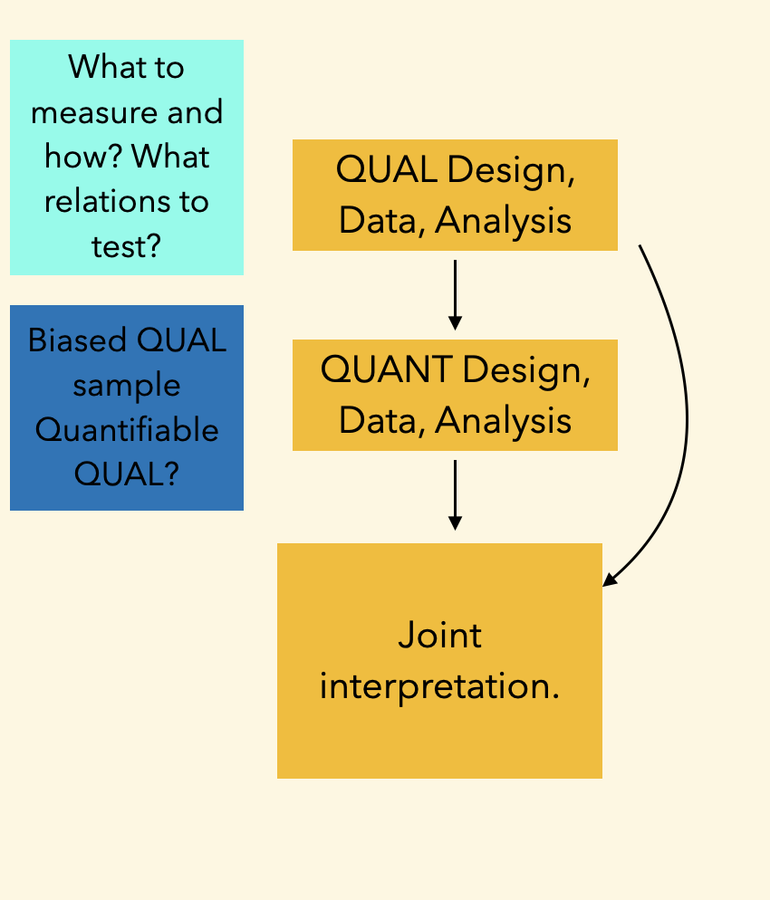
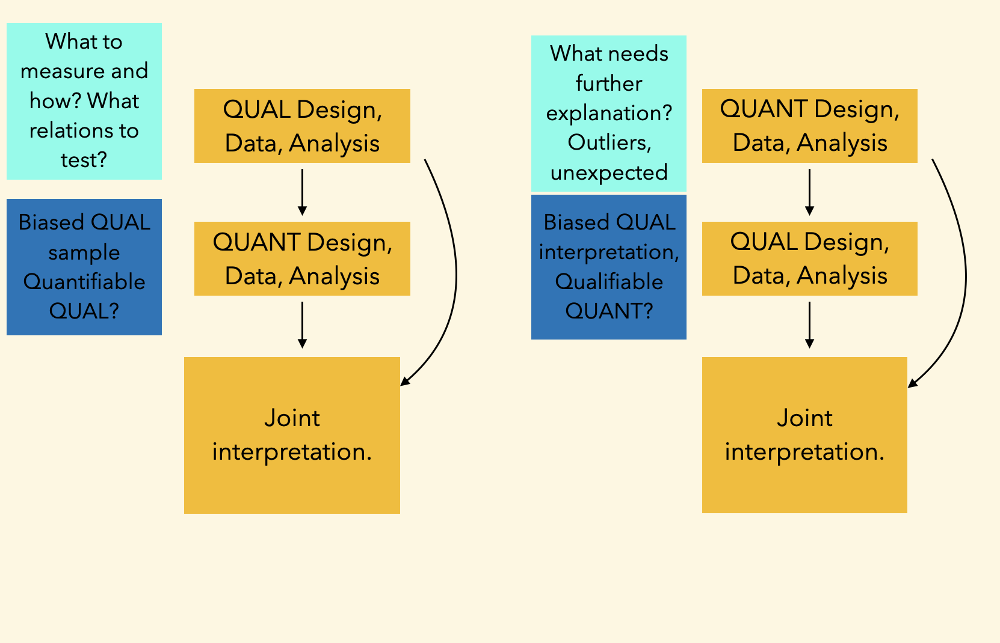
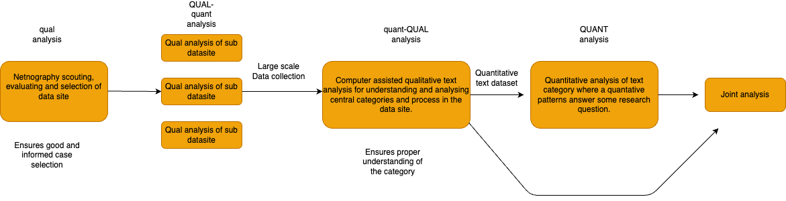

# Lecture 11 Mixed digital methods design of Analysis

### Digital methods
 
 
 
 
    Course responsible: Hjalmar Bang Carlsen, Associate Professor SODAS. hc@sodas.ku.dk
 
---

### Pick up from last time.

---

### Today's tasks

1. Different types of coding
2. Mixed methods designs recap
3. Mixed methods analysis design

---

Insert different types of coding

---

#### **Sequential** design

---
#### **Sequential** design

---

#### Cool thing with digital text data and computational text analysis

1. **Computational methods assist qual analysis** 
    - ensures saturation 
    - ensures against bias qual
    - enables discovery by alternative means

--- 
#### Cool thing with digital text data and computational text analysis

1. Computational methods assist qual analysis 
    - ensures saturation
    - ensures against bias qual
    - enables discovery by alternative means

2. **Qual and quant analysis of same observations**
    - ensures data integration 
    - ensures analytical integration 
    - Allows us to revisit observations

---

---
#### From confirmatory and complementary designs to operations

1. **Confirmatory operations** - confirm patterns found with one method using another
2. **Complementary operations** - use different method to investigate different aspects.

---

#### How have I designed my analysis to best answer the research question/support the main claim?

1. What is the role of each analysis?
    - What question is it suppose to address?
    - What role does it play in the sequential design of your study?
    - Is it a main or supportive analysis

---
#### How have I designed my analysis to best answer the research question/support the main claim?

1. What is the role of each analysis?
    - What question is it suppose to address?
    - What role does it play in the sequential design of your study?
    - Is it a main or supportive analysis
2. What is the overall analytical design and its justification?
    - Is it complementary or confirmatory?
    - How does it help support your main claim?
    - What are the benefits and potential problems given other designs?

---

#### Sequential Analysis Design — Simple

 
 

---

#### Sequential Analysis Design — Hierarchical

 
 

---

#### For Tuesday 

- Talk about quality of inference in both qual and mixed method. 

- Run through the written assignment.

- The presentation for Thursday

