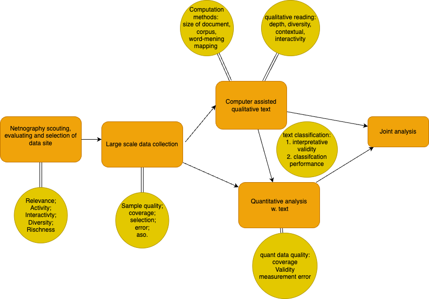
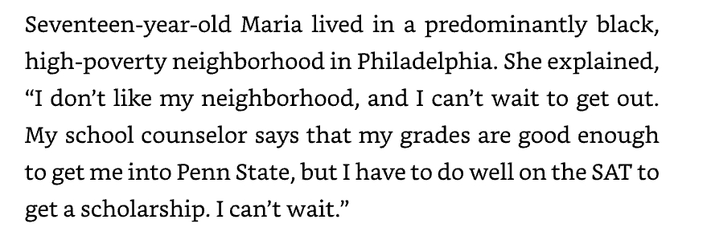
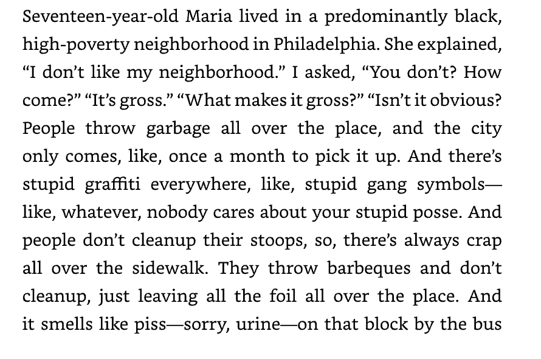

# Lecture 12 Mixed digital methods quality of data and inference

### Digital methods
 
 
 
 
    Course responsible: Hjalmar Bang Carlsen, Associate Professor SODAS. hc@sodas.ku.dk
 
---

### Pick up from last time.

---

### Today's tasks

1. Overview of research: data types, analysis types point of integrations
2. Quality of qualitative data and inference
3. Prototype of the written assignment
4. Run through of the milestone 4 presentation

---

#### Overview of research: data types, analysis types point of integrations

---
#### Different types of data

1. data from immersive observations of data site
2. Secondary/background data around topic/phenomenon
3. Text data
4. activity data
5. relational data
6. temporal data

---
#### Overview of research: data types, analysis types point of integrations

1. Netnography
2. Computer assisted qualitative text analysis 
3. Quantitative text analysis
4. Network analysis
5. Time series analysis 

---

#### **Sequential** design

---
#### **Sequential** design with data quality focus

---

#### Choice of datasite --> data collection

1. **Choice of datasite**
    - Relevance 
    - Activity 
    - Interactivity 
    - Diversity 
    - Richness

---

#### Choice of datasite --> data collection

1. **Choice of datasite**
    - **Main question: is this a good case for studying my topic?**
    - **Main outcome: A sampling frame to collect data from**

---
#### Choice of datasite --> data collection

2. **Collection of large-scale data**
    - **Main question: What is the quality of my sample given my sampling frame?**

---

#### Choice of datasite --> data collection

2. **Collection of large-scale data**
    - **Main question: What is the quality of my sample given my sampling frame?**
        - How many observations from the sampling frame have we collected?
        - How complete is the data on each observation?
        - What is the reason for mismatch? Rate limit, sampling choice, collection error?
---

#### Choice of datasite --> data collection

2. Collection of large-scale data
    - Main question: What is the quality of my sample given my sampling frame?
    - **Main outcome: large-scale data for qualitative and quantitative analysis**

---
#### Data collection --> computer assisted qualitative analysis

1. **Data for computer assisted analysis and sampling**
    - **Main question: Do the computational models have the data required for performance?**
---
#### Data collection --> computer assisted qualitative analysis

1. **Data for computer assisted analysis and sampling**
    - **Main question: Do the computational models have the data required for performance?**
        - Number of documents
        - Length of documents
        - Patterns in word co-occurrence
        - Word -> meaning relations 
---
#### Data collection --> computer assisted qualitative analysis

1. **Data for computer assisted analysis and sampling**
    - **Main question: Do the computational models have the data required for performance?**
    - **Main outcome: Effective way to sample documents for qualitative reading**

---
#### Data collection --> computer assisted qualitative analysis

1. Data for computer assisted analysis and sampling

2. **Text data for qualitative reading:**
    - **Main question: Does the text data have the quality needed for interpretation and analysis?**
 
---
#### Data collection --> computer assisted qualitative analysis

1. Data for computer assisted analysis and sampling

2. **Text data for qualitative reading:**
    - **Main question: Does the text data have the quality needed for interpretation and analysis?**
        - Relevance
        - Number and length to ensure exposure
        - Interactivity and context
        - Richness and depth
        - Diversity and variation

---

#### Data collection --> computer assisted qualitative analysis

1. Data for computer assisted analysis and sampling
2. **Text data for qualitative reading:**
    - **Main question: Does the text data have the quality needed for interpretation and analysis?**
    - **Main outcome: qualitative analysis and codebook training and/or testing text classification**  

--- 
#### Data collection --> computer assisted qualitative analysis

3. **Transformation of qualitative text data to quantitative text data:** 
    - **Main question: How well does my quantitative text variable measure the category derived from qualitative analysis?**
      

--- 
#### Data collection --> computer assisted qualitative analysis

3. **Transformation of qualitative text data to quantitative text data:**
    - **Main question: How well does my quantitative text variable measure the category derived from qualitative analysis?**
        - How strongly does my qualitative analysis of category overlap  with my quantitative operationalization?
        - How well does my classifier perform?
        - Is its measurement error problematic given my analytical interest?

---

#### Data collection --> computer assisted qualitative analysis

3. **Transformation of qualitative text data to quantitative text data:** 
    - **Main question: How well does my quantitative text variable measure the category derived from qualitative analysis?**
    - **Main outcome: A quantitative text variable for quantitative analysis**

---

#### Qualitative literacy - What does this even mean?

---
#### Qualitative literacy

1. Historical movement towards quantitative literacy
2. Still lack conventionalized criteria to judge good qualitative evidence

---
#### Qualitative data and inference - 6 criteria

1. **Exposure** not just sample size

"The greater the contact, the better the data"

"An interview study of 120 people interviewed for 1 hour will have far less exposure than one with 40 people interviewed for 3 hours"

---

#### Qualitative data and inference - 6 criteria

1. Exposure
2. **Cognitive empathy**

"or the degree to which the researcher came to understand those observed close to they understand themselves". 

---
#### Qualitative data and inference - 6 criteria

1. Exposure
2. **Cognitive empathy**

"the degree to which the researcher came to understand those observed close to they understand themselves". 

---
#### Qualitative data and inference - 6 criteria

1. Exposure
2. Cognitive empathy
3. **Heterogeneity** 

"**the extent to which the people or places depicted are as diverse.** One consequence of high exposure is the ability to see difference one previously could not"

---

#### Qualitative data and inference - 6 criteria

1. Exposure
2. Cognitive empathy
3. Heterogeneity
4. **Palpability**

"**the degree to which the evidence presented is not abstract but concrete**...brings the reader close what the participants actually experience."

--- 
#### Qualitative data and inference - 6 criteria

1. Exposure
2. Cognitive empathy
3. Heterogeneity
4. Palpability
5. **Follow-up**

"the extent to which the researcher collected data to answer questions that arose during the data collection process itself."

--- 
#### Qualitative data and inference - 6 criteria

1. Exposure
2. Cognitive empathy
3. Heterogeneity
4. Palpability
5. Follow-up
6. **Self-awareness**

"the extent to which researcher understands the impact of their presence and assumptions on those interviewed or observed."

---
#### Cognitive empathy: understanding perception, meaning and motivation

**Perception**: How people perceive themselves and the world around them

**Meaning**: The significance people assign to what they see, think, say, or do.

**Motivations**: meaning which seems to the actor or the observer an adequate ground for the conduct in question.

---

#### Providing good qualitative evidence

How does Maria see her neighborhood? 

---

#### Providing good qualitative evidence

How does Maria see her neighborhood? 

---
#### Providing good qualitative evidence

1. Do not assume to know what people mean, how people perceive their surroundings and what motivates them

2. Seek to find evidence for their perception, meaning making and motivations

3. Report on actual data as opposed to abstract general assertions.

---
#### Build up of a qualitative analysis section

1. main claim 
2. Index case(post, dialog as.) supporting this claim 
3. An analysis of this case. 
4. supporting cases demonstrating important theoretical variation around the index case

==================================================

4. if possible a least likely cases demonstrating the generality of the finding.
5. exception going against the main claim.

---

Some activists in the Ukrainian refugee solidarity groups also took up the geographical argument. As one activist argues in response to a critique of discrimination(**Main claim**):

*"The critique underlines the tasteless and historical ignorant tendencies in the debate
about foreigners. Especially those who think we give special treatment to Ukrainians,
because they are Christian, white, or European. No, what we are doing is to take responsibility in our local region."*(**index case**)

According to this activist, those who critique the discrimination behind the Ukrainian privilege have misunderstood the situation. Privileging Ukrainians has nothing to do with religion, race, or European identity but simply geographical proximity(**analysis of index case**). Another activist argues: “It is fine that people fled from the war back then [the war in Syria]. But there are many regional countries that can help better locally. Just like we now do locally. That is why I call it neighborhood help.”(**data showing variation**) The justification of the Ukrainian privilege differs in the intensity of their counter-critique; sometimes, the counter-critique is very strong (“tasteless and historical ignorant tendencies”) and other times less harsh, yet insisting on justifying the difference(**important theoretical variation**).

---
#### Exam hand-in

- Max length: **20 pages (three students)** / **25 pages (four students)**.

- Hand in 12 June

---
#### Exam hand-in - **Focus**

1. digital mixed method research design 
2. netnography 
3. computer assisted qualitative text analysis
4. simple quantitative analysis
5. integration between qual and quant text analysis

---
#### Exam hand-in - **Must haves**

1. A description of datasite informed by netnography 
2. A description of data collection
3. A description of the research design
3. A qualitative text analysis, 
4. A quantitative text analysis, 
5. A computational classification must be validated using a manual coded test set 

--- 
#### Exam hand-in - **Prototype**

1. Introduction(1 page) 
2. Background: introducing topic and datasite(s)(1,5 pages)
3. Theory and literature.(2 pages) 
4. Design (1-2 pages)
5. Data collection (1-2 pages)
6. Methods(1-2 pages)
7. Analysis(6-8 pages)
8. conclusion(1-2 pages)

---

#### 1. Introduction

introduce the topic, what we know(literature), what we need to know more about(research questions), what the paper shows(theoretically significant and empirically supported), what methods and data its uses and why a mixed methods approach is suitable

---
#### 2. Background: introducing topic and datasite(s)

Goal: To make the reader familiar with your topic and datasite(s), so that they can judge your use of theory and data collection aso.

Means: Draw on background topical literature and netnography. 

--- 
#### 3. Theory and literature. 

Establish your conceptual/theoretical understanding of your study, in dialog with relevant literature. 

This is also where you can develop your heuristic alla Abbott. Focus on how you use concepts and why. 

---

### 4. Design 

Describe your research design. How different types of data and analyses relate to one another and the overall object of answering the research question. 

---

#### 5. Data collection

Describe your data collection. First your data site with a focus on data. Detail how you collected the data and why you took the choices you did. In general terms describe the challenges and your solution. Report on the data collected: 

- what did you collect and why? 
- what was your sampling frame and target?
- How much did you get of the expected data?

---

#### 6. Methods

Describe the different methods used. Immersion journal, computer assisted text analysis aso. 

Focus on how and why the methods were used the way they were used. 

Report on the performance of your classification models aso. You could also report on the keywords lists here(although they could also be reported in the analysis). You could also report on the central codebook entries for closed coding.

---

#### 7. Analysis
- qual analysis
- quant analysis
- joint interpretation

#### 8. conclusion
- conclude on your results
- evaluate what you could do to strengthen your project

---

#### Appendix 

In pdf and/or online

1. screen of your immersion journal
2. Code
3. Supporting analysis
4. Full Codebook for closed coding

---
#### Presentation Thursday 

15 or 20 min per group depending on the number of groups and size of groups.  
A slideshow with 7 slides: 

- Research question and motivation
- Description of datasite and topic
- Data design
- 3 slides for analysis and results(BOTH qual and quant)
- Conclusion

---

#### Last lecture

1. What have we learned in digital methods?
2. What to take with us to the master thesis and beyond?
3. Notes on ethics and reporting mixed methods results
4. Q&A - Please send me some question/comments you would like to have addressed
5. Oral defense

**Lecture from 0845-1000**