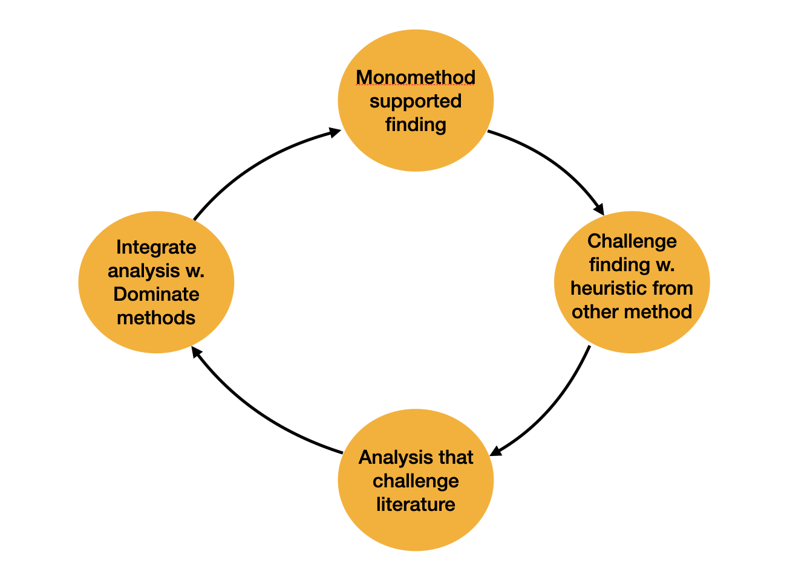
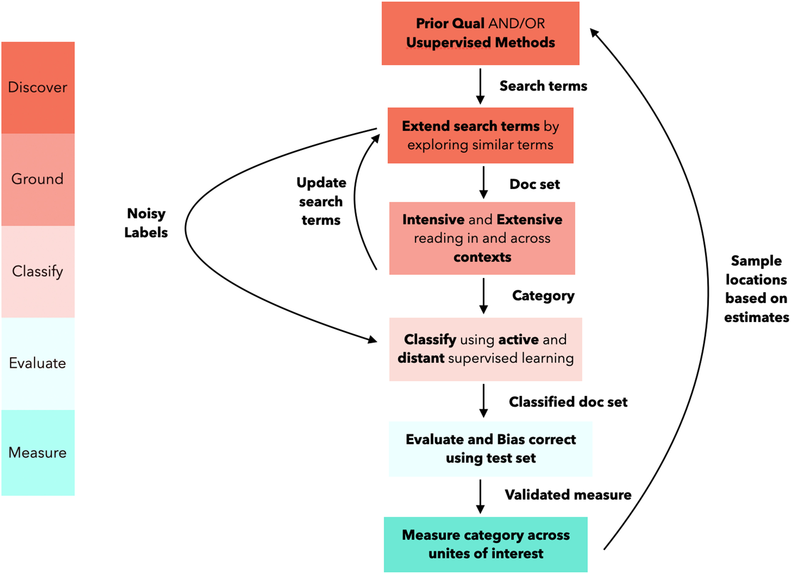

# Lecture -1 Outro

### Digital methods  
   

Course responsible: Hjalmar Bang Carlsen, Associate Professor SODAS. hc@sodas.ku.dk

---

### Evaluation time

---

### Today

1. What have we learned, what can we take with us?
2. What could/should we have done?
3. Oral exam

---

#### What have we learned, what can we take with us?

---

#### What **mixed digital methods** is:

1) In terms of data: *Repurpose and combine qualitative and quantitative digital data*  
2) In terms of data collection methods: *Combine qual (netnography) and quant (web scraping)*  
3) In terms of analysis: *Interpretive AND analytical/statistical (both computer-assisted)*

---

#### How to evaluate, design, and collect mixed digital data

Using both qualitative and quantitative methods and criteria to:

1) Scout for relevant data sites  
2) Evaluate and select a data site  
3) Conduct large-scale data collection  

---

#### Use a mixed digital methods attitude to challenge established knowledge

---

#### Ethnographic sensibility in working with digital data

1) We can't assume we know what is going on  
2) We can't assume we know what people mean  
3) We need to learn from and be exposed to a data site  

#### ...before we can use data for our own analytical purposes. 

---

#### The practice of qualitative analysis

1) How to collect qualitative data  
2) How to analyze and code qualitative data  
3) How to report on our qualitative findings  

---

#### Become attached to your object of study

People are fascinating creatures whose meaning-making and actions call for curious and careful observation.

---

#### Combine computational methods and qualitative reading

1) In a way that does not undermine the quality of either the qualitative or the quantitative analysis  
2) While still exploiting computational methods to read and code more effectively and with greater insight  
3) And to classify large amounts of text  

---

---

#### But still a lot to do!

1) Beyond sampling with keywords: sentence similarity, document embedding, and more  

2) More detailed implementation of Large Language Models in both the discovery and classification steps

---

#### What is missing?!

---

#### Visualizations?!?

- Visual displays of data can create maps that guide qualitative reading  
- Visualizations can also be tools for theory generation, which can then be investigated qualitatively and quantitatively  

---

#### Images?!?

- Images are an important large-scale qualitative data source that demand mixed digital methods approaches  
- Machine learning models offer similar methodological opportunities as those used for text  

---

#### Exam hand-in – **Focus**

* Digital mixed method research design  
* Netnography  
* Computer-assisted qualitative text analysis  
* Simple quantitative analysis  
* Integration between qual and quant text analysis  

---

#### Exam hand-in – **Must haves**

* A description of the data site informed by netnography  
* A description of the data collection  
* A description of the research design  
* A qualitative text analysis  
* A quantitative text analysis  
* A computational classification that is validated using a manually coded test set  

---

#### Exam hand-in – **Prototype**

**Digital Mixed Methods Project of 25 pages**

1. Introduction (1 page)  
2. Background: introducing topic and data site(s) (1.5 pages)  
3. Theory and literature (2 pages)  
4. Design (1–2 pages)  
5. Data collection (1–2 pages)  
6. Methods (1–2 pages)  
7. Analysis (6–8 pages)  
8. Conclusion (1–2 pages)  

---

### How to write a good results and discussion section (1)  

**Qualitative Analysis**

1) Structure your presentation with clear, purposeful subsections  
2) Include extensive quotes from your material to support your analysis  
3) Go beyond description: analyze your material and explicitly state what each subsection teaches us  

---

### How to write a good results and discussion section (2)  

**Quantitative Analysis**

1) Organize your content with clear, purposeful subsections  
2) Clearly explain what you are measuring and why  
3) Present results in a meaningful and accessible way (e.g., graphs, tables)  
4) Explain your figures, analyze your results, and draw well-supported conclusions  

---

### How to write a good results and discussion section (3)  

**Discussion**

* Discuss any limitations in light of sampling issues, measurement problems, or interpretation uncertainties  
* Explicate how your findings, drawing on mixed methods strategies, provide a valuable contribution  
* Evaluate the strengths and weaknesses of your mixed method strategy  
* Point to alternative computer-assisted mixed method strategies that might improve your approach  

---

#### Oral examination

**1. 40 min for groups of 3 and 45 min for groups of 4**

**GROUPS OF 3:**  
5–7 minutes for presentation, about 30 minutes discussion with Kristoffer and me, 5 min for evaluation  

**GROUPS OF 4:**  
5–8 minutes for presentation, about 30–35 minutes discussion with Kristoffer and me, 5 min for evaluation  

**2. Time: 16 and 17 of June**
**3. Timeslots will be given after you have handed in 12 June**

---

#### Oral examination – what to expect

1) Clarifying, critical, and curious questions around the topic, concepts, research design, methods, and findings  
2) You typically can't get a worse grade from the oral exam—it can only improve your mark  
3) We will address you as a group at the outset  
4) Kristoffer and I will try to create as positive an atmosphere as possible, but we will engage critically with your work  

---

#### Oral examination – what to do

1. A chance to clarify, sharpen, and defend your work  
2. PowerPoint is optional (display on your laptop)  
3. Use the oral format to present your project in an engaging and sharp way  
4. Address obvious issues in your project  
5. Steer the conversation in a direction that highlights your strengths  

---

#### Last supervision on Friday and presentation (last milestone)

---

#### Any very last questions?

---

