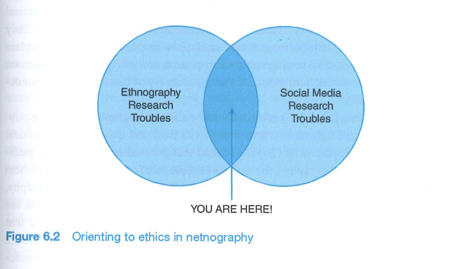
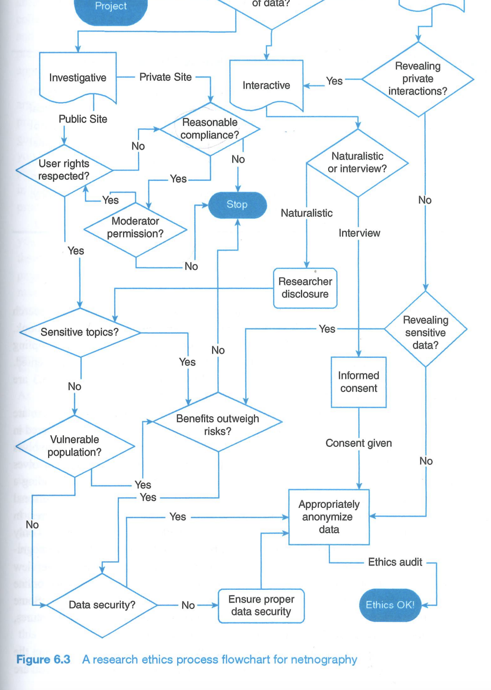

# Lecture 3 evaluating and selecting data site

### Digital methods lecture 3
 
 
 
 
    Course responsible: Hjalmar Bang Carlsen, Associate Professor SODAS. hc@sodas.ku.dk
 
---

### Pick up from last time.

---

## Today's tasks

1. Evaluate datasite
2. Evaluate data
3. Ethical evaluation

---

## last times mood

Positive, Curious, Daring(and a bit practical) 

---

## Today's mood

evaluative, Critical, realistic 

---

### A reality checklist for digital methods

---
#### 1. Role of digital media in relation to object of study?

 

- How much of your study object occurs in the medium that you are studying? 

- Are you studying media traces for themselves or as proxies?

---

### 2. Definition of the study object 

"*Working with secondary data, you do not have the leisure to define your objects of study as you wish, but you are obliged to consider (at least in part) the way in which they are formatted by the technical and organisational standards of the medium.*" 

---

### 2. Definition of the study object 
 

- Is your operationalisation attuned to the formats of the medium? 

A retweet as an undirected social tie?

- Is your operationalisation attuned to the practices of the medium users?

#ahastagwithoutanytopicreferentjustmessyingaround

---
### 2. Definition of the study object 

- Tensions between **theoretical relevant** VS **medium** and **practice** attuned 

- Too much focus on theoretical relevance risks **mismatch between theory and data**

- Too much focus on being practice and medium attuned risks **being irrelevant** 

- Using **heuristics** to creatively **solve the tension**(example mobilized public opinion)

---
### 3. From single-platform to cross-platform analysis 

 

- Does the phenomenon that you are studying spill across several media?

Is this actually happing on insta?

- Have you different but comparable operationalisations, for the different media? 

Facebook comment the same as twitter comment?

---
### 4. Corpus demarcation and data access 

 

- What does your corpus represent? 

Within datasite sampling

- Are you accounting for the ways in which data are ‘given’ by the media?

API, webpages all provide information a specific way for specific reasons

---

In groups choice and answer one or two of Venturini et al's questions: 

- How much of your study object occurs in the medium that you are studying? 
- Are you studying media traces for themselves or as proxies?
- Is your operationalisation attuned to the formats of the medium? 
- Is your operationalisation attuned to the practices of the medium users?
- Does the phenomenon that you are studying spill across several media?

---
 
### Investigation process
 
 
1. **Simplification**: translate research question/topic into search terms, and then

2. **Search operations** that return options for further explorations, that require

3. **scouting operations** that provide initials observations on potentials datasites. 

4. **Evaluation** and **selection** of datasite to become a part of the study. 

4. **Collect** data form the datasite  

---

### 1. Scouting 

**What is in the site?** 
    - Actors?
    - Talk?
    - Relations?
    - Actions?

---

**How does the datasite function?**

- How do you become a user? 
- How to you produce content?
- How do you consume content?(newsfeed, forum ect.)
- How do users interact?
- Is there content moderation?
- Who are the moderators?

---

In groups try to answer the questions regarding the functioning of your datasite.

---

**The background of the datasite**

- What is the **purpose** of the site?
- Who **owns** the datasite?
- How does the datasite **function**?

---

### Example

---
### **Quality** criteria for the **datasites**

1. Relevance
2. Activity
3. Interactivity
4. Diversity
5. Richness

---

In groups discuss and evaluate your datasite(s) in relation to one more or more of datasite quality criteria: relevance, activity, interactivity, diversity, richness.

---
### **Quality** criteria for **data**

 

- Text data 

Depth, variance, context 

- Relational data

strength, obligations, endurance, coverage

---
### **Quality** criteria for **data**

 

- Actor data

relevant background information, functional role, in-depth description, trustworthiness, coverage.

- Activity data 

meaningful, temporal information, cost, context 

---

In groups take your central concept and it's data trace, evaluate your data trace given its datatype and its relation to your central concept.

---
### **Ethics** in mixed methods digital research

---
### **Ethical** considerations at different stages 

1. Research question

2. Data selection and collection 

3. Data storage and security

4. Interpretation and analysis

5. Reporting and representation

---
### **Ethical** considerations in data selection and collection

- Private or public datasite?

- Informational expectations?

- Explicit no-research-statement?

- Sensitive topic?

- Vulnerable population? 

---

---

In groups discuss ethics in relation to your data collection. What are the most important troubles and concerns? Try to run through the ethics flowchart. What concerns arise?

---

Feedback on your Milestone 1 by me thursday(25/4) from 10-13. 10 min per group. A google sheet with times will be sent out, put your groups name on a time slot.   

---
 
 

### Next time: Data collection and sampling!

