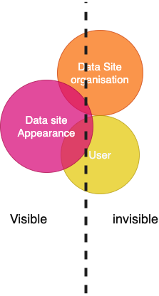

# Lecture 5 Interactive/interview data collection

### Digital methods lecture 5
 
 
 
 
    Course responsible: Hjalmar Bang Carlsen, Associate Professor SODAS. hc@sodas.ku.dk
 
---

### Pick up from last time.

---

### Today's tasks

1. what is interview data?
2. why collect interview data?
3. how to collect interview data?

---

#### What is **interview data**?

- interview **data**: open-ended responses to questions
- interview **method**: interview between researcher and respondent
- interview **target**: experiences, opinions, feelings, perceptions, motivations, beliefs, internal states 

---
#### What is the **interview method(s)**

- primarily **open-ended** questions
- **designed** to answer a research question
- smaller or larger in **scope**
- more or less **structured**
- more or less **embedded in natural** surroundings

---

#### to **ask** vs to **observe**

- interview(**account**) data vs observational(**action**) data  
- **obtrusive** vs **non**-obtrusive

---
#### Debunking interview/account data

- People say what we want to hear: **social desirability bias**
- People can't remember correctly: **recall bias**
- Peoples actions and opinions are **situationally determined**

#### **But asking has and will remain a central method of data collection** 

---
#### **Why** do interviews **?** 

1) A study of regional police departments found that Southern jutland where 15 times more active than other departments. Why?

---
#### **Why** do interviews **?** 

1. To account for hidden aspects of the social media activity.

2. In our study of corona help groups we found many offering help, but few asking for help. Why?

---

#### **Why** do interviews **?** 

1. To account for hidden organizational aspects of the social media activity.

2. To account for decisions to (not) engage online.

3. Understand specific experiences in-depth

4. History and context of an online community

5. Learn about certain symbols meaning and use

6. In-depth understanding of the (offline) social situations and perception of community members

---

#### Interviews to learn about the **invisible** 

1. **Organizational** background
2. **Context** of your topic
2. Reasons and **experiences** with (non)participating
3. Social context/life world of the users

---

#### Interviews to understand the **visible** 

1. Meaning of utterances
2. Meaning of symbols
2. Reasons for certain action
3. **Interpretations** of communication

---

#### **Do’s** and **Don’ts** for Interviewing 

1. Do ask only **one question** at a time 
2. Do ask about a **specific** **action**, event, or experience 
3. Do **use probes** to learn many **details** 
4. Do ask the respondent questions that allow them to draw on their **expert knowledge** 
5. Do get **enough details** to create a mental image of a moment 
6. Do show that you are **listening closely** 
7. **Don’t** give them the possible responses for answering 
8. **Don’t** move too fast & Don’t ask them to talk about what other people think

---

#### **How** to ask questions?

1. Descriptions of **concrete experiences** as an obligatory passage point
2. Probe for more **detail** AND **context**
3. Questions are mostly **open-ended**
3. Yet, a questions is a task and the **task** need to be as **clear** as possible
4. Balance conservational quality and data quality/relevance 

---

#### **How** to ask questions?

1. What are you going to ask about? **The interview guide**
2. Who are you going to ask? **Sampling**
3. How are you going to get them to talk? **Recruitment**
4. What is the medium of the interview? **Mode** 

---

#### **Interview guide**

1. Set of main questions and sub-questions/probes
2. Operationalization of concepts into questions
3. Organized into different phases opening, main questions, and closing questions
2. Should be carefully developed and tested
3. Can vary in structuredness and detail

---

#### Closed vs Open Questions

1. A preschool child is likely to suffer if his or her mother works. 
2. It is much better for everyone involved if the man is the achiever outside the home and the woman takes care of the home and family.
3. A working mother can establish just as warm and secure a relationship with her children as a mother who does not work.

---

### Closed vs Open Questions

1. A preschool child is likely to suffer if his or her mother works. 
2. It is much better for everyone involved if the man is the achiever outside the home and the woman takes care of the home and family.
3. A working mother can establish just as warm and secure a relationship with her children as a mother who does not work.

Do you have an opinion about how women and men divide paid work and taking care of things inside the home? 
For example, do you think it is better for one partner to work outside the home and the other to care for the home and family, or is it better for couples to share equally, or is there another arrangement that you think is better?

---

**Main questions:** Do you have an opinion about how women and men divide paid work and taking care of things inside the home? 
For example, do you think it is better for one partner to work outside the home and the other to care for the home and family, or is it better for couples to share equally, or is there another arrangement that you think is better?

**Follow up probes:** Why do you say that? Have you always held these views, or have your views changed over the years? When do you think they [changed/stayed the same]? What happened to change your mind?

---

###### Example of interview guide.

1. Okay, so now that we’ve talked about your past experiences, let’s talk about what things are like in your life today, both at work and in your personal life. You said you were (employed full-time/employed part-time/not employed) at the moment, right?

IF NOT CURRENTLY EMPLOYED FULL-TIME, SKIP TO “NOT EMPLOYED FULL-TIME” SECTION BELOW. IF EMPLOYED FULL-TIME: 

2. What kind of work do you do? (IF NECESSARY: What is your job title or position? What are some of your main duties? What kind of organization do you work for?) 

3. How long have you been (working at that job/in that line of work)? (SPECIFY YEARS OR MONTHS) 

4. What are the main reasons you chose that line of work? (**IF NECESSARY**: Why that job in particular? Did you consider doing something else? Did you consider not working?) 

5. About how many hours do you usually work in an average week? Do you work on a regular schedule, or is it different? **FOLLOW UPS:** Is this the schedule you prefer, or would you prefer a different one? What would be your ideal schedule? 

---

#### **Sampling**

1. Who is your target: moderators, participants, non-participants?
2. How many cases do you need? Saturations
3. Selection effects: Don't only talk to talkers
4. Don't talk to people who are not engaged in your topic
5. Panel of experts or representatives of a group

---

#### **Recruitment**

1. Online contact is hard
2. Moderators are a practical and important source of knowledge and connections
3. Many forums do not allow for recruiting participants through their forum

---

#### Modes

#### **Golden Standard**: The face-to-face interview

1-2 hours of in-depth interview in the respodents familiar and private surroundings. 

---

#### **Mediated** Modes 

- phone
- zoom

- email
- chat based
- Dairy

---

#### **Modes** Map

---

#### The importance of **low-cost**

1. Low-cost makes new designs possible
2. Email/chat based longitudinal interview with medium size N
3. Digital Daries

---

#### The importance of **tracebility/recordability**

1. Screen sharing
2. Photo sharing/recordings
3. Social media logs 

---

### Done