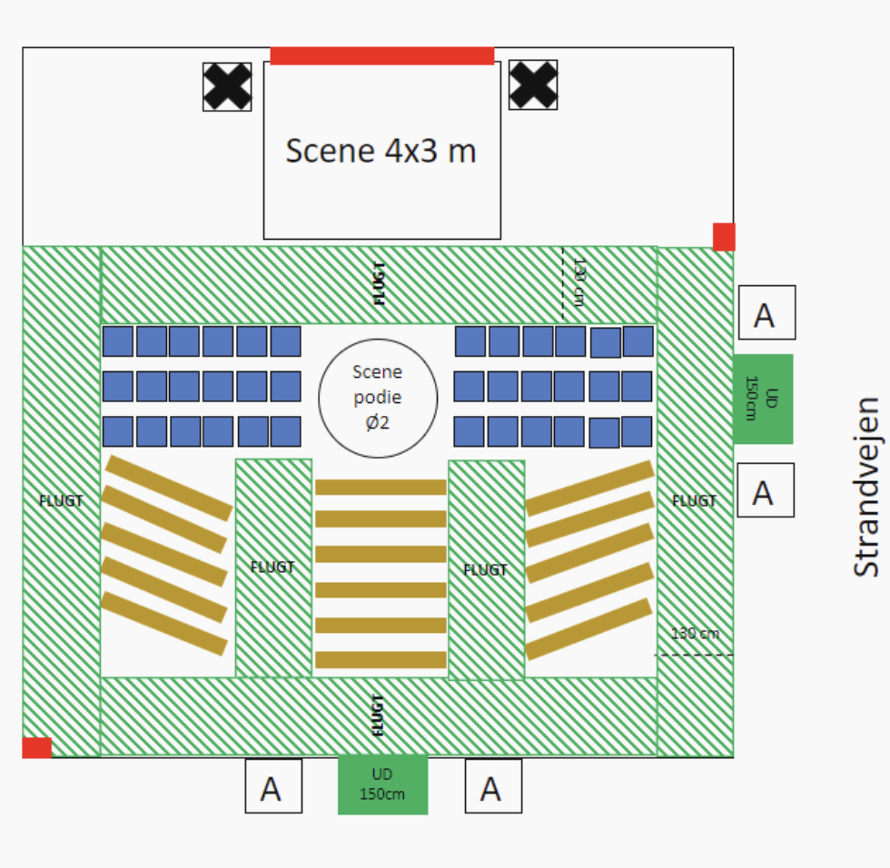

# Lecture 5 Netnography

### Digital methods lecture 5
 
 
 
 
    Course responsible: Hjalmar Bang Carlsen, Associate Professor SODAS. hc@sodas.ku.dk
 
---

### Pick up from last time.

---

#### **Imagine** in predigital time a data source which provided: 

- detialed data on the interaction between people
- detialed description of the environment
- measurement in continuos time as events unfold
- direct observation of cause and effect 
- in-depth coverage of the outer and inner life of the research subjects

---

#### **Imagine** in predigital time a data source which provided: 

- detialed data on the interaction between people
- detialed description of the environment
- measurement in continuos time as events unfold
- direct observation of cause and effect 
- in-depth coverage of the outer and inner life of the research subjects

#### **Ethnography**

---

### Today's tasks

1. what is ethnography?
2. why ethnography?
3. what is netnography?
4. why netnography?
5. how netnography?

---

#### what is **ethnography**?

---

#### **Fieldwork as method** 

-  the **location** as the unite of investigation

A region, a civil society organization, Neirboorhood

- Intensive observations:

detialed observation, participation and follow-up questions

- Extensive observation: 

for many months to multiple years

---
#### **What** ethnographers **record as data**?

1. #### **Detailed descriptions** of the **social interaction** they observe
    - what is going on?
    - what is being said?
    - what is being done?
    - With what consequence?

---
#### **What** ethnographers **record as data**?

1. **Detailed descriptions** of the **social interaction** they observe
2. #### **Detailed descriptions** of the setting
    - where is the interaction occuring?
    - how does it look?  
    - how is the physical setting organized?
    - how is the light and smell?
    - how is the atmosphere?

---

#### **What** ethnographers **record as data**?

3. #### **Detialed description** of the actors
    - where do they come from?
    - what is there personality?
    - how do they look, dress and carry themselves?
    - what ambitions, opinions and beleifs do they hold?
    - how do they perceive their surroundings?
    - what plans, goals and strategies do they have?
    - what habits, everyday rutines do they have?

---

#### **What** ethnographers **record as data**?

1. **Detailed descriptions** of the **social interaction** they observe
2. **Detailed descriptions** of the **setting**
3. **Detialed description** of the actors
4. #### **Detialed reflections** on being in the field
    - researchers relations to members, feelings 
    - researchers attempts at mastering practices
    - researchers reactions to certain events
    - reflexive account of the researcher positionality
    - Interpretative reflexivity

---
#### How is the observations recorded?

- Memory & Small notes --> detialed fieldnotes
    - During observations, small notes can be taken on the spot
    - During interaction/participation, small notes when possible
    - After observation, extensive work in writing up fieldnotes from memory and small notes to **detialed descriptions**.

---
#### How is the observations recorded?

- Memory & Small notes --> detial fieldnotes
- **Observational templates**

---
#### How is the observations recorded?

- Memory & Small notes --> detial fieldnotes
- Observational templates
- **Photos, video and audio recordings**

---
#### Why ethnography

- most comprehensive data on social life
- provides evidence on what people actually do, directly!
- make sense of that which we do not understand.

--- 
#### Why ethnography

- people act towards things on the basis of the meaning they ascribe to things.
- people act and makes sense in specific situations which constrains and enable certain interpretations and actions.
- Outcomes in social life are the product of certain process and mechanisms

---
#### Why ethnography
- cognitive empaphy
- detailed concrete decription of social situations
- detailed concrete decription of social processes

---
#### What is **netnography**

---     
#### The many names of Online Ethnography = Digital ethnography / Virtual ethnography / Netnography

*“Digital Ethnography is not a research ‘method’ that is bounded. Nor is it a unit of activity or a technique with a beginning or end. Rather, it is processual”* (Pink et al. 2016, Digital Ethnography)

*“Virtual ethnography is conceived as an adaptive and connective approach that takes online sites seriously as places for social interaction but also seeks to follow the threads of meaning-making (both online and offline) through which these interactions make sense to participants.”* (Hine 2008, Virtual Ethnography)

---
#### The many names of Online Ethnography = Digital ethnography / Virtual ethnography / Netnography

*“Netnography today is not merely another name for online ethnography, but a set of general instructions relating to a specific way to conduct qualitative social media research using a combination of 25 different research practices grouped into three distinct categories of data collection, data analysis, and data interpretation ‘movements’.”* (Kozinets 2019: 7)

---

#### Changes in the place of research

- Challenging the assumption that social life is bounded to a location
- The place as a **network**
- The place as a **public space**
- The place as a **stream**

--- 

##### **Discuss** in groups the character of your datasite, what does in resemble a **bounded location**, a **network** or a **public space** or **something else**?

---

#### Changes in what is observed: 

- from **in-situ interaction** to **text mediated interaction**
- from physical setting to **interfaces**
- from city infrastructure to **platform** infrastructure
- from persons in flesh and blood to **profiles**

---

#### Changes in **how we observe**

*”On a methodological level, social media configure themselves as environments that provide the ethnographer with an array of preset tools that actually organize the space and flow of interaction"* (Caliandro 2018)

---

#### Changes in **how we observe**

- From noting down unfoldning events(etnography) to **navigating** in large scale archive of communication. 
- **Actively manipulate** how we observe 
    - Focus on one actors activity over time
    - Focus on comparing actors in two different location
    - Focus on select groups interaction 
    - Focus on interaction between specific actors

---

#### **Immersive** operations

- Immersion Journal is a specific way of organizing netnographic observations, information, thoughts, reflections, etc.
- Recorded in a systematic way: you will need to learn practices, habits, standards for writing in it.
- Includes the data you collect, your accounting for it, and your reflections about it. 
- The five data operations from earlier was about collecting data
- **Immersive operations** is about **curating and writing data**.

--- 

#### **Immersive** operations

1. **Reconnoitering**: To make a reconnaisance of something
2. **Recording**: Keeping track of data
3. **Researching**: Making sense of the data
4. **Reflecting**: Your own reflections and reactions to your 

--- 

#### **Reconnoitering**

- Providing a picture of the landscape of your data collection > landscape mapping.
- Telescope and microscope: zooming in and out 
- Four types of deep data in reconnoitering:
    - Resonant data: ”emotionally appealing” / ”speaks to us" 
    - Lead user data: **extreme cases**
    - Exceptions to the rule: **deviant cases**
    - Micrological data: **paradigmatic cases**
    - Controversy data: **explicative cases**

--- 

#### **Recording** in your immersion journal

 
 

##### I have download all the data - **BOOM** recording done!

---

#### **Recording** in your immersion journal

 

##### I have download all the data - **BOOM** recording done!

 

##### In netnography data only becomes data through the effect is has on the **netnographers experience and interpretation**. 

---

#### **Recording** in your immersion journal

 

##### I have download all the data - **BOOM** recording done!

 

##### In netnography data only becomes data through the effect is has on the **netnographers experience and interpretation**. 

 

##### Therefore recording means **documenting your interpretations, experience and even emotional reactions** to your observations 

---

#### **Recording** in your immersion journal

-  Keeping track of data collected, decisions made, key pieces of information, as well as qualitative engagements with data sites.
- Recording things in the immersion journal is about describing: describe what you see, what you think, what and how you interpret something you have just observed.
- concrete descriptions and interpretations rather than just abstract labels
-  Record via whatever format you choose (more on this in a minute)

---
#### Researching Operation - conceptual notes

- **Conceptual notes** connecting observation to theoretical concepts
- **Abstract** from your concrete case and **theorize**
- **Formulate hypothesis** that can be developed and tested
 
---

####  Reflecting 

- Writing down what you think about interactions, images, discussions, etc. It is introspective and reflects a first-person perspective.
- Challenge your own bias, habituated ways of thinking, presumptions, and affective reactions by writing down reflections
- You are the research instrument, your honest reflections contributes to the transparency of the research process.

---

#### Organizing your immersion journal
- There is no universal template for the format to be used for an immersion journal.

- You do not need to get a physical book but you can. 

---

#### Organizing your immersion journal
#### **BUT** we recommend something like:

- **Spreadsheets organized** in some purposeful way(observational template), w. meta data on observations, your descriptions, interpretations and conceptual notes.

- **Plain text document** where you narrate your research experience connecting your observations and interpretation of distinct observations into a holistic account. Metadata(when notes are made, on what observations, using what observational template)  

---
#### What is the role of netnography in your project

1. Scout, critically evaluate, learn about and select relevant datasites
2. Inform large scale data collection
3. Collect relevant information from multiple sources 
4. In-depth analysis of text communication in your data site
5. Qualify, inform, contextualize and/or challenge large-scale text analysis/network analysis/quant analysis. 

---
#### Managing expectations

- We do not expect you to go as deep in your immersion and engagement as both Kozinets are the hallmarks of netnography.
- There is simply too little time.
- But... we do expect you to use the netnography as a key digital method alongside network and content analysis, both contributing to these and as a method in its own right.
- Do as much you can, as best as you can.

--- 

### Milestone 2 

Is due on Friday. You will only get feedback from TA's this time around. 

You have to hand in:

- Updated Research Question
- Data Collection Plan
- Preliminary Data Analysis Design/plan

--- 

#### tak for idag