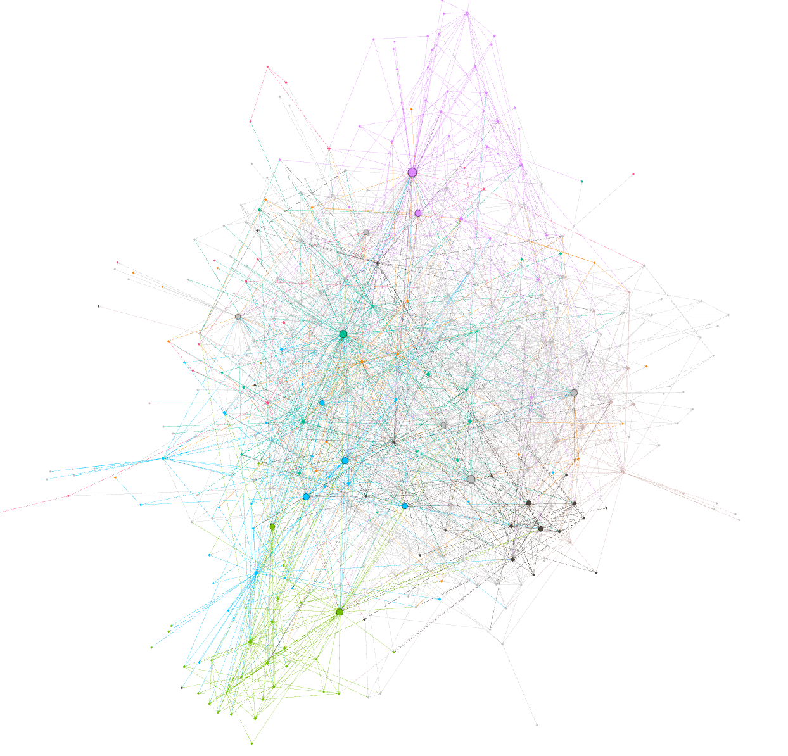
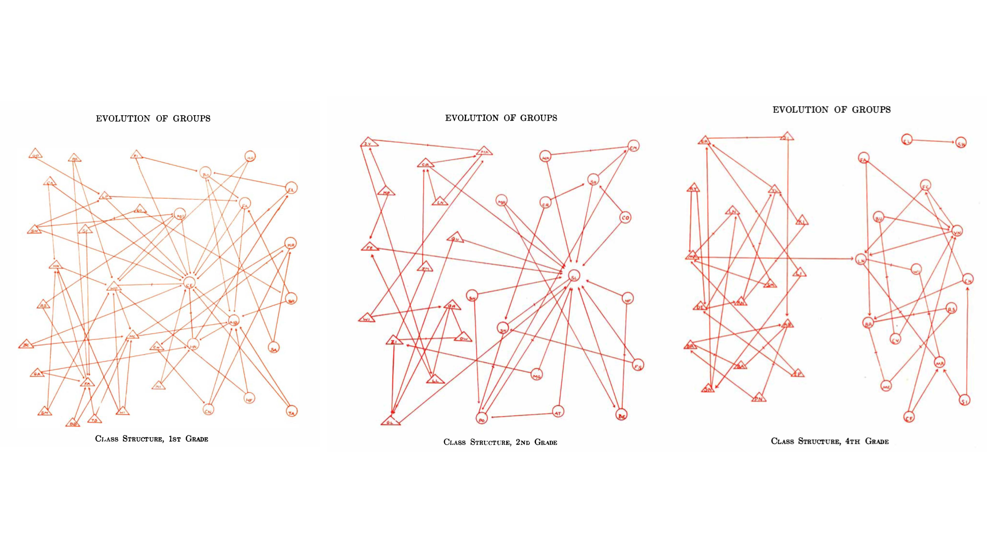
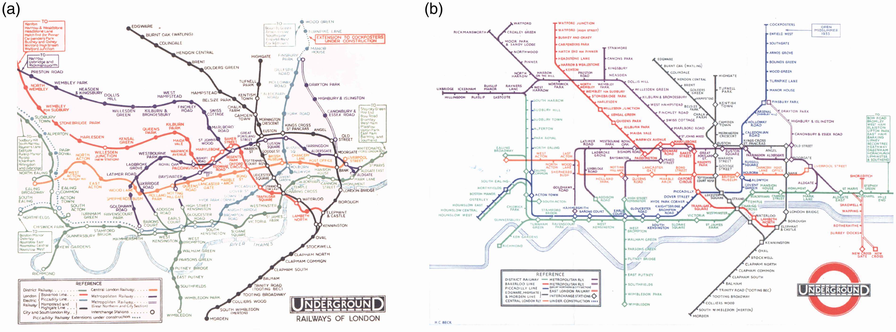
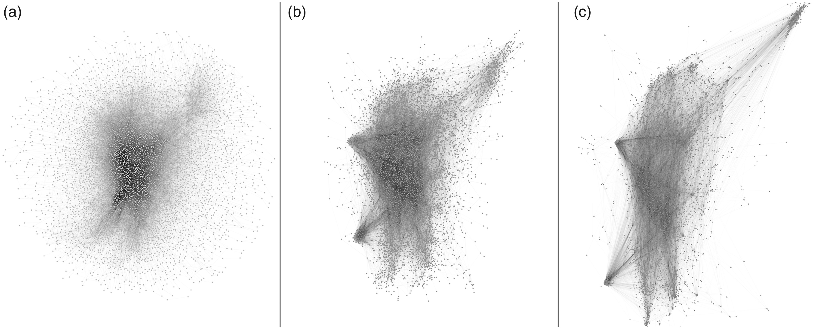
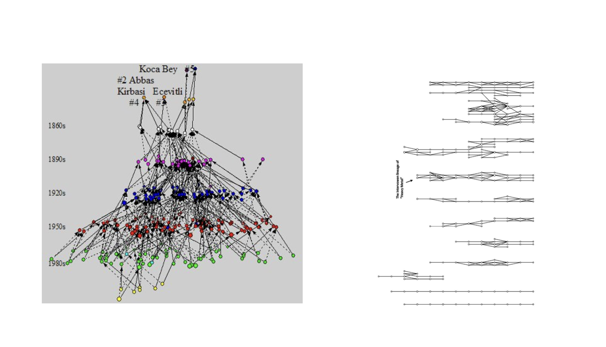
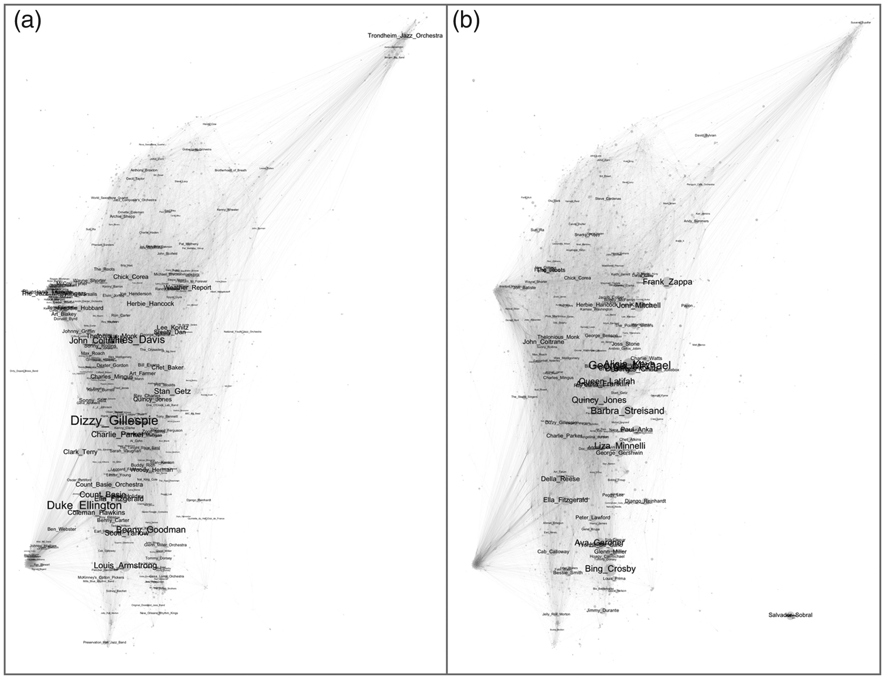
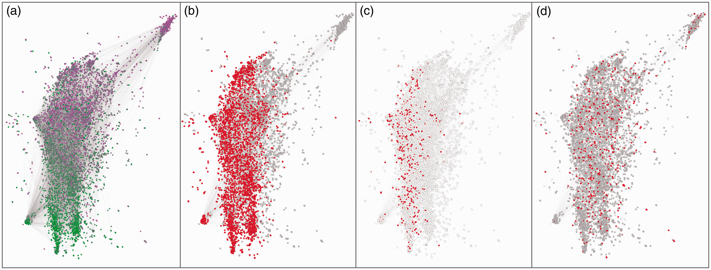
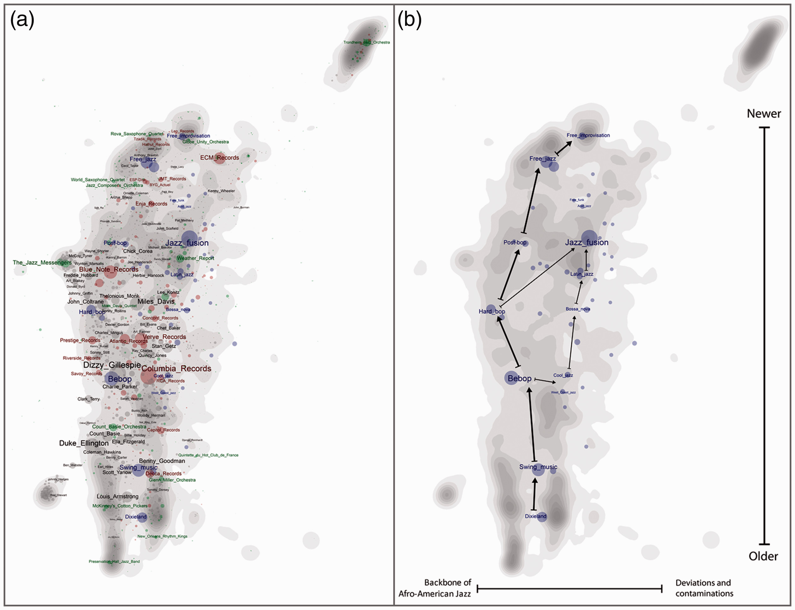

# Lecture 7 Networks

### Digital methods lecture 7
 
 
 
 
    Course responsible: Hjalmar Bang Carlsen, Associate Professor SODAS. hc@sodas.ku.dk
 
---

### Pick up from last time.

---

#### What is the role of netnography in your project

1. Scout, critically evaluate, learn about and select relevant datasites
2. Inform large scale data collection
3. Collect relevant information from multiple sources 
4. In-depth analysis of text communication in your data site
5. Qualify, inform, contextualize and/or challenge large-scale text analysis/network analysis/quant analysis. 

---

#### Today's program

1. Recap on Networks 
2. The challenge of social network analysis in a digital age
3. Mixed approach to and with networks
4. Visual Network Analysis
5. Thinking through your data

---

#### Recap on **networks**

1. #### The **Relations**: formation, content and dynamics of ties

---

#### Recap on **networks**

1. The Relations: formation, content and dynamics of ties
2. #### The **Actors Relations**: The social context of the actors

---

#### Recap on **networks**

1. The Relations: formation, content and dynamics of ties
2. The Actors Relations: The social context of the actors
3. #### The **Structure** of Relations: The **organization** of social life

---

#### Different types of ties

Insert pdf

--- 

#### Different types of network structure

Insert pdf

---

#### The potential and problems of digital data and social networks

1. #### **Low-cost**

---

#### The potential and problems of digital data and social networks

1. #### **Low-cost** BUT **Low-validity**

---

#### The potential and problems of digital data and social networks

1. **Low-cost** BUT **Low-validity**
2. #### **Whole Networks**  

---

#### The potential and problems of digital data and social networks

1. **Low-cost** BUT **Low-validity**
2. #### **Whole Networks** BUT **technology and case specific**

---

#### The potential and problems of digital data and social networks

1. **Low-cost** BUT **Low-validity**
2. **Whole Networks** BUT **tecnology and case specific**
3. #### **Actual interaction** 

---

#### The potential and problems of digital data and social networks

1. **Low-cost** BUT **Low-validity**
2. **Whole Networks** BUT **tecnology and case specific**
3. #### **Actual interaction** BUT **ephemeral** and **ambiguous**

---

#### **Mixed** Approaches to Networks
 

---

#### **Mixed** Approaches to Networks

"*With respect to network research, qualitative methods are therefore most appropriate for investigating network **practices** and **network perceptions** and **interpretations*** (cf. Hollstein 2011)"

---

#### **Mixed** Approaches to Networks

"*With respect to network research, qualitative methods are therefore most appropriate for investigating network **practices** and **network perceptions** and **interpretations*** (cf. Hollstein 2011)"

*In **network research**, **quantitative** methods are geared toward **mathematical** descriptions and analyses of interactions, relations, and **network structures**. Measured values and numbers, for instance, are density and centrality measures or the triad census (e.g., Gluesing et al., this volume). More sophisticated analyses apply formal models and statistical procedures, such as **block model analysis***....

---
#### **Mixed** Approaches to Networks 3 **Benefits**

1. #### **Thick descriptions** of **networks**, network **practices**, and **interpretations**

---
#### **Mixed** Approaches to Networks 3 **Benefits**

1. **Thick descriptions** of **networks**, network **practices**, and **interpretations**
2. #### Network **Effects** and **Change**

---
#### **Mixed** Approaches to Networks 3 **Benefits**

1. **Thick descriptions** of **networks**, network **practices**, and **interpretations**
2. Network **Effects** and **Change**
3. #### **Organizational/situational** embedding of networks and interaction

---
#### How can we mix?
1. #### **Network construct qualified** by qualitative analysis
2. Build networks from qualitative data and analysis
3. Interpret quant in light of qual (vise versa)
4. Use networks to sample qual
5. Use networks to map social field/org

---
#### How can we mix?
1. **Network construct qualified** by qualitative analysis
2. #### **Build networks** from **qualitative data** and analysis
3. Interpret quant in light of qual (vise versa)
4. Use networks to sample qual
5. Use networks to map social field/org

---
#### How can we mix?
1. **Network construct qualified** by qualitative analysis
2. **Build networks** from **qualitative data** and analysis
3. #### **Interpret quant** in light of **qual** (vise versa)
4. Use networks to sample qual
5. Use networks to map social field/org
---
#### How can we mix?
1. **Network construct qualified** by qualitative analysis
2. **Build networks** from **qualitative data** and analysis
3. **Interpret quant** in light of **qual** (vise versa)
4. #### Use networks to **sample qual**
5. Use networks to map social field/org
---
#### How can we mix?
1. **Network construct qualified** by qualitative analysis
2. **Build networks** from **qualitative data** and analysis
3. **Interpret quant** in light of **qual** (vise versa)
4. Use networks to **sample qual**
5. #### Use networks to **map social field/org**

---
#### Network construct qualified by qualitative analysis

1. What is a **meaningful node**?
2. What is a **meaningful edge**?
3. What **meaningful analysis** can be pursued?

---

#### In groups discuss what **type of network** you could make with your data and what it could be used for? 

#### - what are the **nodes**?
#### - what are the **edges**?

---
#### **Build networks** from **qualitative data** and analysis

1. #### **Text classification methods** enables the large scale transformation of **text into ties**

2. #### The **type** of tie, **strength** of tie. 

---
#### Use networks to sample qual

1. #### Snowball sample

---
#### Use networks to sample qual

1. Snowball sample
2. #### Diversity case selection across regions/clusters

---
#### Use networks to sample qual

1. Snowball sample
2. Diversity case selection across regions/clusters
3. #### Different typological position or structures
    - **most influencial**
    - **bridge**
    - **well connected group** 

---
#### Use networks to map social field/org

1. #### **Representing** your datasite: **This is where I was**!

---
#### Use networks to map social field/org

1. **Representing** your datasite: **This is where I was**!
2. #### Use to map to **design your travels**
---
#### Use networks to map social field/org

1. **Representing** your datasite: **This is where I was**!
2. Use to map to **design your travels**
3. #### Demonstrate **within-case saturation/generalizability**

---
#### Use networks to map social field/org

1. **Representing** your datasite: **This is where I was**!
2. Use to map to **design your travels**
3. Demonstrate **within-case saturation/generalizability**
4. #### explore and analyze the structure/organization of your field

---

#### In groups discuss what your projects could use network analysis for?

---

#### **Visual** Network **Analysis**

---

#### **Visual** Network **Analysis**

*The forms taken by the interrelation of individuals is a structure and the complete pattern of these structures within a group is its **organization**. The expression of an **individual position** can be better **visualized** through a **sociogram** than through a sociometric equation. In the course of reading sociograms it became evident that **certain structures** recur with **regularity**.* (Moreno in Who Shall Survive 1934, 103-104)

---
#### **Visual** Network **Analysis**
 

---
#### **Visual** Network **Analysis**

---
#### **Visual** Network **Analysis**

"*instead of trying to **overcome the ambiguity** of points-and-lines charts, it considers it **positively**. Not as a burden but as an asset. The same ambiguity that makes network charts **unfit for hypothesis confirmation**, we contend, makes them **invaluable** for **exploratory data analysis**.*"(Venturini et al 2021)

---
#### **Visual** Network **Analysis**

1. #### As qual data/analysis **superficial**

---
#### **Visual** Network **Analysis**

1. As qual data/analysis superficial
2. #### As quant analysis **not robust**

---
#### **Visual** Network **Analysis**

1. As qual data/analysis superficial
2. As quant analysis not robust
3. #### Yet, the both qual and quant information **jointly displayed** can facilitate **discovery**

---
#### What to do with VNA?

1. Positioning nodes/spatializating network
2. Sizing and colouring nodes
3. Naming poles and clusters
4. Qualitative interpretation nodes and clusters

--- 
#### Positioning nodes/spatializating network
 

---

#### Do not just explore data BUT **try out perspectives** on network data!

---

---

#### Sizing and **coloring** nodes

1. Drawing on your qual knowledge you can experiment with different ways of thinking about in-degree and out-degree. 

2. Filter based on node degree

3. Color the nodes in under to investigate the organization of some attribute in the network

---
#### Different ways to size nodes

---

#### Distribution of attributes

---

#### Interpret **clusters** and **poles** 

---

#### Operationalization: Be **creative** but not **crazy**

Uneasy fit between much of our data and the traditional way of thinking of networks

1. #### **Post** and **comment** data - what to do?

---

#### Operationalization: Be **creative** but not **crazy**

Uneasy fit between much of our data and the traditional way of thinking of networks

1. **Post** and **comment** data - what to do?
2. #### **Users** and **active** in different **groups/threads** - what to do?

---
#### Operationalization: Be **creative** but not **crazy**

Uneasy fit between much of our data and the traditional way of thinking of networks

1. **Post** and **comment** data - what to do?
2. **Users** and **active** in different **groups/threads** - what to do?
3. Any other data relation? 

---
#### Gephi for network exploration

---
#### Exercise for today

1. Construct a network with from your data. If you do not have a meaningful sample, make a small play version of your dataset. 

2. Try out the different ways of exploring and using networks covered in class and note the pros and cons given both our data and project design.

3. Continue with your project work.

---

#### tak for idag - Remember No teaching thursday!  