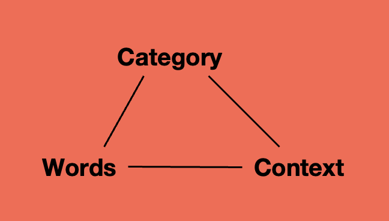
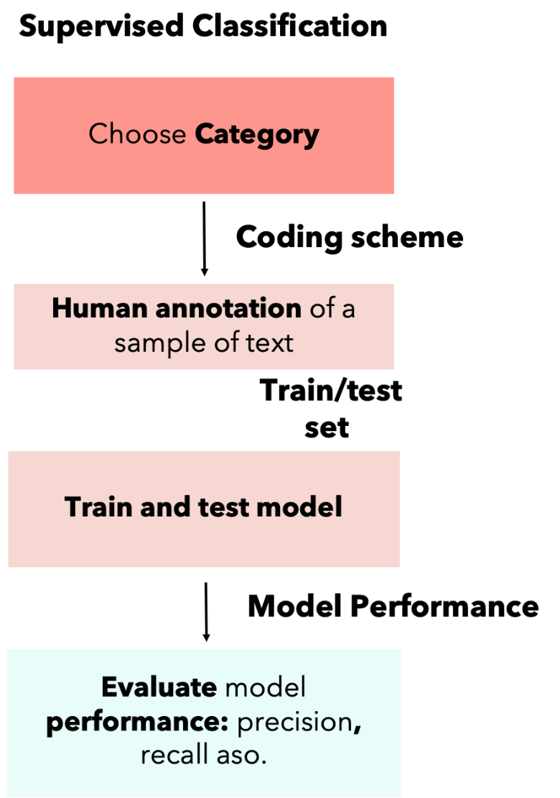
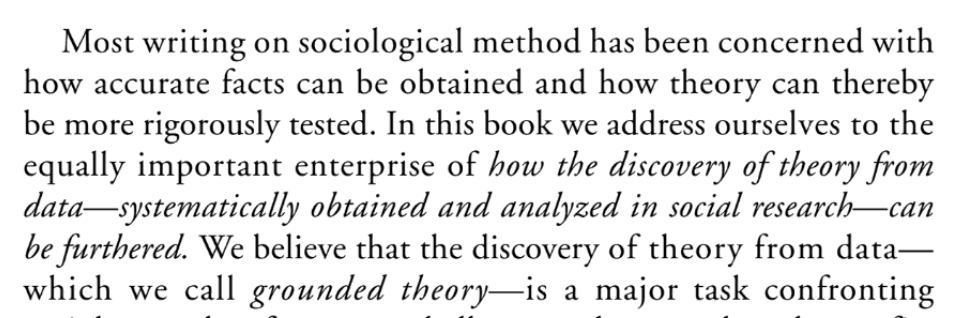
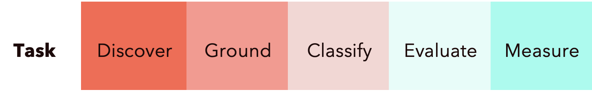
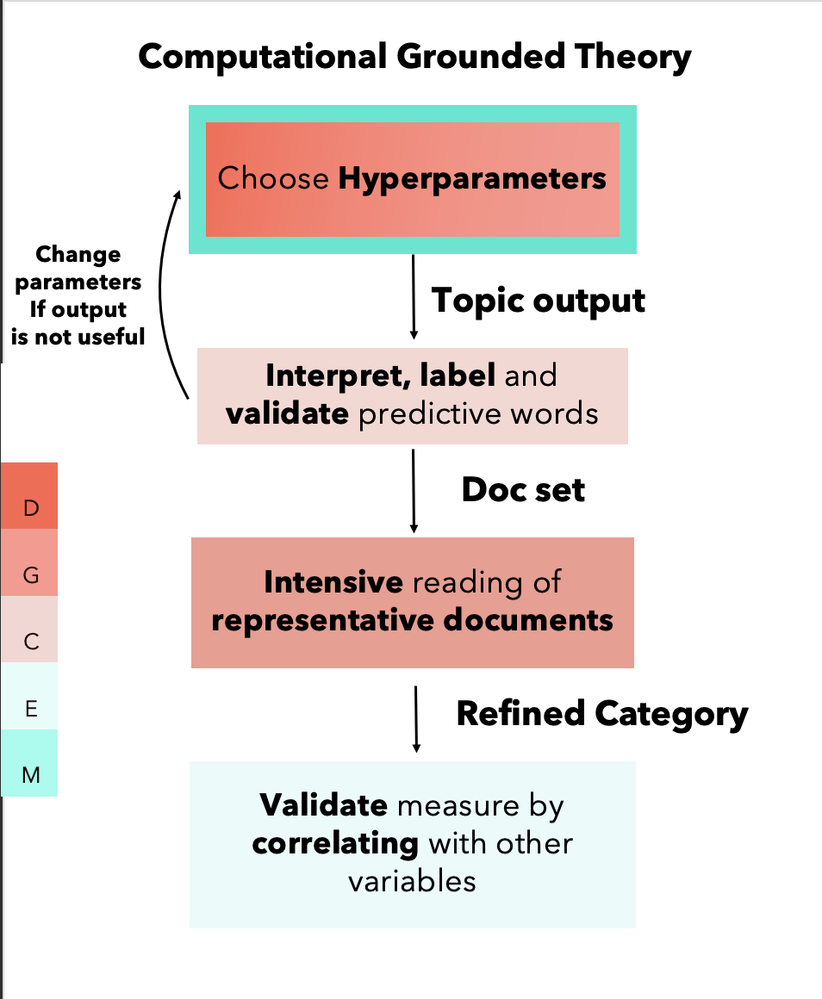

# Computer assisted content analysis

### Digital methods lecture 7
 
 
 
 
    Course responsible: Hjalmar Bang Carlsen, Associate Professor SODAS. hc@sodas.ku.dk
 
---

### Pick up from last time.

---

insert classifiction task.

---

#### Todays program 

1. Text-as-data
3. Inductive vs deductive approaches to text analysis
4. Deduction and its problems
5. Inductive approaches and its problems 
6. Overview of the next 2. session
7. Midway evaluation

---
#### Text as qualitative data 

1. Interviews and field notes 
2. Historical achieves
3. Diary data
4. Dialog data
5. Newspaper data

---
#### Text as qualitative data 

1. Turn field notes into theories of culture and human nature
2. Turn diary data into accounts of lived experience
3. Turn dialogs into social theories of interaction
4. Turn achieves into grand historical narratives

--- 

##### If you are interested in working with text data alot of qualitative research will provide you inspiration for how to do **careful** and **ambitious** research with text material

----
#### **Large** scale **text data**

1. Public or Private
2. Conventional or non-conventional
3. Monological or Dialogical 

---

--- 
#### **Large** scale **text data**

1. Volume of text 
2. Variation in contexts (low or high)
3. Variation in population (low or high)
4. Variation in categories 
5. Variation in words

---

#### What is in a text? Or what do people do with text?

What theoretically interesting concept are captured in your text data?

---
#### What is in a text? Or what do people do with text?

1. **Frame** stuff -  schema of interpretation that organize experience
2. **Evaluate** stuff - use principles in order to determine the value of something
3. **Self presentation** -  perform a certain version of themselves to an audience
4. **Narrate** stuff - tell stories, combines events and actors in certain causal accounts

--- 

#### What is in a text? Or what do people do with text?

What theoretically interesting concept are captured in your text data?

---

#### How do we find, understand, classify and measure interesting stuff in text? 

1. Deductive approach 
2. Inductive approach
3. Abductive approach

---
#### **Deductive approach** 

---

#### Deductive approach - Choose concept and choose relevant definition

1. Choose a concept
2. Choose a definition relevant to the research context

---
#### Choosing **relevant** definition: Example of **hate speech**

1. Public shouting at someone contrary to good morals and private defamation.
2. The public disturbing of peace through an attack on human dignity.	
3. [C]ontempt for a population group by allusion to race, colour, national or ethnic origin, religious belief, sexual orientation or transgender identity or expression is guilty of agitation against a population group.

        Hietanen, M., & Eddebo, J. (2023). Towards a Definition of Hate Speech—With a Focus on Online Contexts. Journal of Communication Inquiry, 47(4), 440-458.

---

1. “is directed against a specified or easily identifiable individual or, more commonly, a group of individuals based on an arbitrary or normatively irrelevant feature”; 

2. “stigmatizes the
target group by implicitly or explicitly ascribing to it qualities widely regarded as undesirable”;
 
3. “target group…as an undesirable presence and a legitimate object of hostility”.  

        Howard, Jeffrey W. "Free speech and hate speech." Annual Review of Political Science 22 (2019): 93-109.

---
#### Develop a **coding scheme** based on one of these conceptualization 

1. Translate the concept into a set of instruction used to code text

2. That can be applied in the research context

3. Manually classified text that can used to train AND test a supervised model

---

#### The good things about the more deductive approach

1. Theoretical relevance
2. Conceptual clarity 
3. Direct validation of model performance

---

#### The problems about the more deductive approach

1. Missed theoretical potential
2. Inadequate conceptualization given empirical site
3. Misinterpretation of data

---

#### **Inductive** approaches

---

#### **Grounded** Theory: Theorizing from **systematic data** analysis

---

#### Grounded Theory

1. Theoretical sampling
2. Constant comparative method
3. Theory generation grounded in data analysis  

---
#### Constant comparative method 

1. Comparing incidents applicable to each category,
2. Integrating categories and their properties,  
3. Delimiting the theory, 
4. Writing the theory.

---

#### Computational grounded theory

---

#### What to do with a very large text data set?

 

---
#### Discovery

1. Sample a known location? 
2. Read a random sample?
3. Search for documents using a keywords?

---

#### Discovery

1. Sample a known location(**generalizable?**) 
2. Read a random sample(**Too rare**)
3. Search for documents using a keywords(**assume we know how people speak**)

---

1. **Pattern Discovery**
2. **Pattern Refinement**
3. **Pattern Confirmation**

---

1. Discovery pattern in the **entire corpus** as opposed a biased case
2. Produce **simplified** list of words, based on actual frequencies as opposed to biased human reading
3. These lists can be coded, but in procedure that is a “**reproducible and scientifically valid grounded theory**”

--- 

### **Topic 1**

- celebration
- makeup
- responsibility
- press
- unlikely
- accurate
- stream

---

### **Topic 2**

- newspaper
- gene
- teacher
- manufacturer
- growth
- estate
- significance

---
#### Assumption in computational discovery

1. Simple words resist biased human reading
2. Model returns meaningful, consistent categories
3. Top words represent these categories
4. Model captures all relevant theoretical categories in the data 
5. That our model returns co-occuring clusters words
6. Patterns in co-occurring words map onto meaning

---
#### Does LDA find return co-occuring clusters of words?

---

---
#### Does Patterns in co-occurring words map onto meaning?

1. *A word should be known by the company it keeps*

2. An utterance can only be understood in "*the context of the situation*".

3. We simply do not know the relation between statistical patterns and meaning-making

---
#### Refinement - **computationally guided deep reading**

1. confirm the plausibility, 

2. add interpretation and 

3. possibly modify the patterns in order to provide a holistic reading.

---

#### Refinement 

computational guidance is supposed to solve:

1. natural limits to scaling deep reading

"*read and interpret any amount of text without the burden of reading the full text*"

2. Biased nature of our reading

*research community “can trust that when a quote is chosen as an example of something, it is not an outlier but is indeed representative of some theme in the text”* (Nelson, 2020, 26).

---

|                        File Name                       |                                                       Text (Head)                                                       | Movement History Topic Weight | Antiwar Topic Weight |
|:------------------------------------------------------:|:-----------------------------------------------------------------------------------------------------------------------:|:-----------------------------:|:--------------------:|
| nyc.redstockings.1973.sarachild. powerofhistory-28.txt | THE ARCS OF HISTORY tific and fearless writers of her day” and Elizabeth Cady Stanton, too, “the matchless writer.” […] | 0.967030332                   | 0.00031311           |
| nyc.redstockings.1973.sarachild. powerofhistory-27.txt | Ten any idea of what that work was all about “it’s purpose and the breadth of its contents and even its method-we […]   | 0.963596868                   | 0.000113575          |
| nyc.redstockings.1973.sarachild. powerofhistory-29.txt | Paraging depiction of the History in the bibliography, it suddenly struck m_e that Stanton, Anthony and Gage’s […]      | 0.947334513                   | 0.000125144          |
| nyc.redstockings.1973.sarachild. powerofhistory-30.txt | Said it was. And those who did take action in the area of history “especially for the present record”did not […]        | 0.940307645                   | 0.000347795          |
| nyc.redstockings.1973.sarachild. powerofhistory-26.txt | And so their absence from history books meant there weren’t any. We had to discover the problem of […]                  | 0.91508104                    | 2.90019E-05          |
| nyc.redstockings.1973.sarachild. powerofhistory-18.txt | Opposite of Beauvoir’s book which was disappearing from the lists. I soon learned, even without reading it, […]         | 0.864953051                   | 0.000107619          |

---

#### Refinement: assumptions

1. Top documents are **paradigmatic/representative** of the whole cluster 

2. A researcher particular **interpretation** of the documents **generalizes** to the whole cluster

3. **Minimal immersion** from the researcher is enough to ensure **understanding** - interpretation is easy. 

---

#### Validation and measurement

1. Topic models are **both** used of **discovery** and **measurement**

2. Validation typically happens through inspection of top words and documents

3. Sometimes indirect validation happens by correlating with other indicators of the same category. 

---

#### Assumptions

1. We can't or do not have to do direct validation like we do in supervised machine learning

2. Face-validity is enough to ensure against measurement error and model instability

3. Indirect validation is enough to ensure against measurement error and model instability

--- 

#### Measurement problems

insert slides

--- 
#### From computer lead to computer assisted text analysis

1. Discovery: **from determining** the universe of categories to **helping** with their **discovery**

2. Refinement/grounding: from relying on top documents to extensive and intensive reading using machine learning methods to effectively sample documents 

3. Classification, validation and measurement: from indirect to direct validation, from unsupervised to supervised classification. 

---

---

insert pdf from with dictionary possibility...

---

#### Mid course evaluation

5 min for each task

1. Write down a max of 3 good things about the course and 3 bad things about the course

2. Go over the list vote for 3 bad things and 3 good things that where not captured by your own evaluation.

10 min. collectively talk about the points. 

