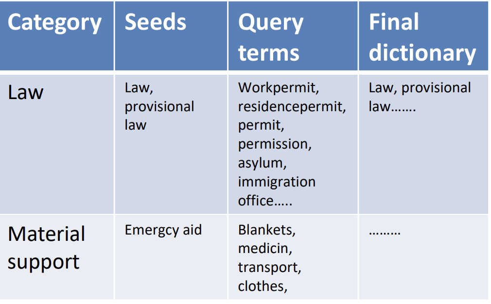
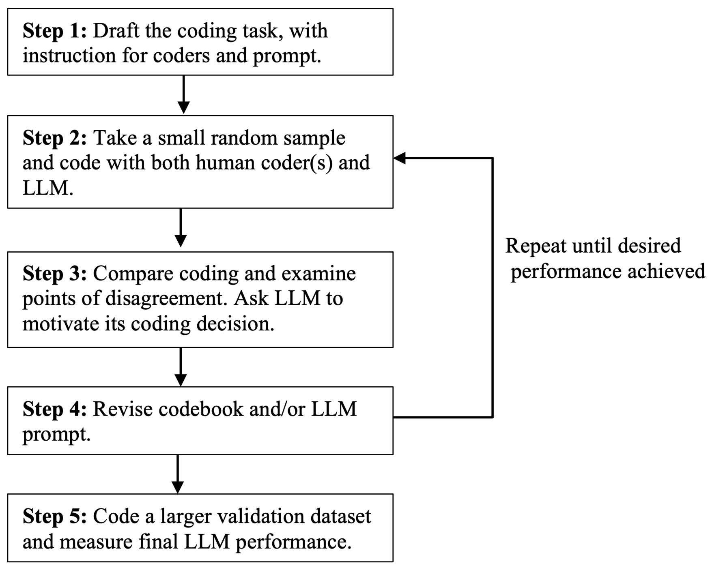

# Language Model and dictionary classification and quantitative text analysis

### Digital methods lecture 
 
 
 
 
    Course responsible: Hjalmar Bang Carlsen, Associate Professor SODAS. hc@sodas.ku.dk
 
---

#### Overview of **lecture**

1) **From Qualitative to Quantitative text analysis**
2) **Different classification strategies**
3) **Different types of quantitative analysis**

---

#### **From Qualitative to Quantitative text analysis**

---

#### Qualitative analysis divided into different focuses areas

1) Quote your index case

2) Analyze the quote and tell the reader what it means. 

3) Use other quotes to support important variation

--- 

#### Justifying the differential treatment  

1) **Situational justification**:  *“if it was a civil war in Ukraine no one would help just as in Syrian”*

2) **Proximity justification**:  *“It is fine that people fled from the war back then[war in Syria]. But there are many regional countries that can help better locally. Just like we now do locally. That is why I call it neighborhood help”*

3) **Different type of refugee**: *“The Ukrainians show great gratitude and don’t want to be a burden. The other demanded and demanded and did not want to conform. They might now learn that it would help them to have another attitude”*

--- 

#### **From Qualitative to Quantitative text analysis**

1) Quantify **aspects** of your qualitative analysis
2) The **transformation** can have different degrees of alignment
    * Complete alignment
    * Partial alignment
    * Proxy

--- 

#### **From Qualitative to Quantitative text analysis**

1) **Complete alignment** = When your classification target is the understanding of the category derived from the qualitative analysis

2) **Partial alignment** = when your classification target is aspects of the category derived from the qualitative analysis: from *accusations of discrimination* to *discrimination as topic*.

3) **Proxy** = when your classification target is something else which works as a proxy of category derived from the qualitative analysis: from *boundary works/othering* to mentioning of *out-group* 

---
#### Group discusstion

1) Discuss in groups what aspects of your qualitative analysis you want to quantify. 

2) and how your quantitative measure will align with your qualitative analysis. 

---

 
 
 

## Different **classification strategies**

---

#### **Classification** intro 

1) Classification concerns putting documents into certain classes, saying that they are or are not of certain kind. 

2) The manual approach to this is closed coding, which we will use to validate our computational classification. 

3) Importantly, we see the manual classification as the ground truth. 

--- 

#### Different **classification strategies**

1) **Dictionary methods** that match words/strings. Logic is that if a certain list of words is used it indicates a certain category. 

2) **Supervised machine learning** where you train a model to predict a certain category. 

3) **Unsupervised machine learning** where you use the topics found by the model to classify text.

4) Using instruct tuned **Language Models** to classify text. LM apply a set of instruction to classifying text, an closed coding agent.  

---

####  **Dictionary methods**

1. Take a list of words that indicate your category. 

2. Run through all documents in your corpus and check if they contain a word from the list.

3. If so classify the documents as containing that category. 

4. Binary variable measuring if document contain variable or not

---

####  **Dictionary methods**

1) **Start**: Take a list of words that indicate your category. 

2) **Refine**: Sample a small number of random documents for each word and evaluate. Update your dictionary accordingly. 

3) **Apply** refined dictionary to entire corpus

4) **Validate** dictionary using a test set based on manual closed coding. 
    * Remember that you are validating meaning not word use.  
    * Typically you will do validation based on prediction, that is true_positive/(true_positive+false_positives) 

--- 

#### How to make your dictionary? 

---

#### Problems with the dictionary

1) Assumes that the category can be captured by words-in-isolations
2) Yet, words change their meaning based on other words and their function in a sentence.
3) Meaning of text is on the level of sentences, paragraphs and dialog
4) Dictionary methods are bad at the more implicit and boundaries to other categories. 

5) *Accusation of discrimination** vs *topic of discrimination*. Stance on a topic vs. talking about a topic.

---

#### Language model classification

1) Can use instructions to classify text(so called prompts). 

2) Zero-shot classification, without any training of the model. 

3) Can operate on the level of documents as opposed to words. 

4) Way more computationally expensive 

--- 

Törn
berg
(2024) 

---

#### Language model classification

1) **Draft prompt for coding task**. Based on your code book you develop a prompt that instructs your model how to annotate the text. As with your codebook be instructive, show examples of when to apply and when not to apply. 

3) **Initial test**. Take a small random sample and evaluate the annotations. **Refine** your instruction if needed. 

4) **Apply** the instructions on the whole corpus

5) **Validate** classification based on a random sample to measure performance. 

---

#### Model choice

1) Use a local model for data security reasons
2) Use an instruct model 
3) Use a small(ish) model for computational efficiency
4) I use ollama for running small LM locally. Download here: https://ollama.com/ and look for instructions here https://github.com/ollama/ollama

---

#### Computational classification, some concerns

* Be realistic in what  themes/categories can be quantified and automated.

* Have a good reason for wanting to create a quantitative measure

* Your classification can go wrong because of: 
    * Poor human coding
    * Inherently ambivalent content
    * Bad model
    * Bad data

---

Look at the code. 

---

#### In groups consider if you will go with a dictionary approach or a language model approach and why?

---

#### **Quantitative** text analysis

---

#### From **Qual** to **Quant**

1) From small N to large N
2) From textual to statistical evidence
3) From uncertainty in meaning to uncertainty distribution

---

#### **Quantitative** text analysis focus

1) **How much?**: Compare the prevalence of categories
2) **Who**: Compare groups of actors across categories
3) **When**: Look at categories over time
4) **Where**: Compare categories across different places

---

#### How much - why prevalence?

1) In many cases we need a a category to exist over a certain threshold for it be **informative**. This especially in a online context. 

3) **Corpus/datasite level**: group(incel), a public(twitter), subculture

2) **Characterization of datasite**: popularity, importance, exposure, function. 

3) **Mix rational:** the quant analysis of prevalence insures against biased generalization, cherry picking in qual analysis.

4) OBS: comparing apples and oranges, differential measurement error. 

---

#### **Who say what?**: Compare groups of actors across categories

1) How the distribution of categories vary across different actors.
2) **Actor types:** inferred demographics, activity levels, cohorts, network position, roles 
3) **Characterize different actors:** inequality between social groups, social groups different frames, collective identities, values aso. 
4) **Mix rational:** the quant analysis of difference between groups ensures against selection bias and strengthen generalizations.

---

#### **When**: Look at the trends over time

1) How the distribution of categories vary over time.
2) **temporal focus**: long term trends, before and after events, periodic patterns/cyclic patterns
3) **Temporal characterization**: trends, emergence, effect of events, temporal order
4) **Mix rational:** the quant analysis of distribution of time demonstrates the difference.   

---
#### **Where**: Compare categories across different places
 
1) How the distribution of categories vary over place.
2) **Place focus**: different sites, regions, nations aso.
3) **Characterize different place:** group culture, participation, ressources.
4) **Mix rational:** Ensure against biased selection within each place and generalize the difference between place. 

---

#### **Discuss** which type of focus you could have in your project and how the focus would be?

--- 

#### Milestone 4
30 min per group depending on the number of groups and size of
groups.
A slideshow with 7 slides:
1. Research question and motivation
2. Description of datasite and topic
3. Data design
4. 3 slides for analysis and results(BOTH qual and quant)
5. Conclusion

max half time for presentation and min half for feedback. 

---

### Next time: Exam & what you want to hear about 
