

# Computer assisted focused coding, closed coding and measurement 

### Digital methods 
 
 
 
 
    Course responsible: Hjalmar Bang Carlsen, Associate Professor SODAS. hc@sodas.ku.dk
 
---

#### Overview of **text analysis**

1) **Open coding**: Try out different interpretation perspective --> **find an analytical focus**
2) **Focused coding**: **Test and develop** a specific analytical focus
3) **Write up** a qualitative analysis around this analytical focus
4) **Quantify** aspects of this qualitative text analysis, into **quantitative measure**
5) Use this measure in a **quantitative analysis**. 

---
#### Overview of **computer assisted** text analysis

1) Use **unsupervised methods** to get an **overview** of discourse and find **interesting categories** and **seed words**. 

2) **Expand seed words** with **computational methods** for keyword expansion.

3) **Use keywords** to **search** for documents for **in-depth reading**. 

4) After extensive and intensive reading of relevant document **build a text classifier**. 

5) Use a **manual labelled test** set in order to validate your classifier.

---

#### From **open** coding to **focused** coding

---

#### Pick up on open coding session

---

#### Different types of coding: Open, focused and closed

---

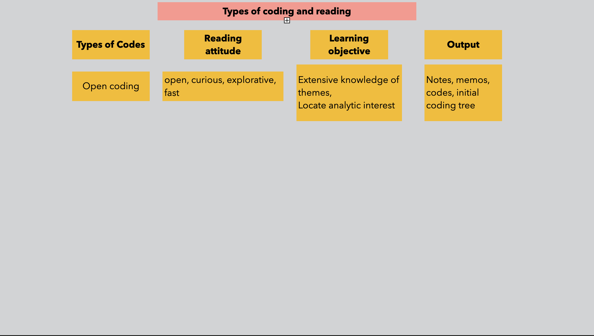

---

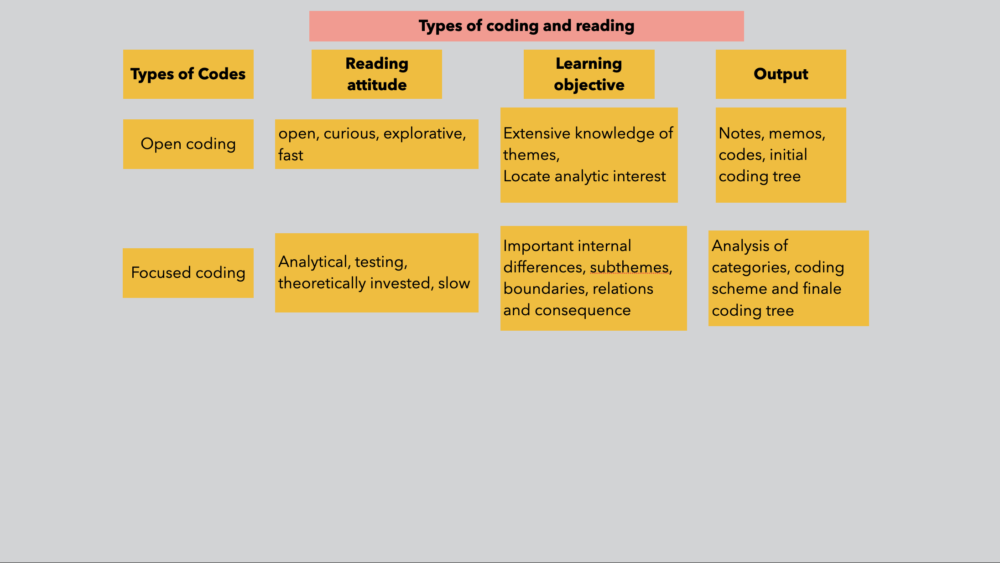

---

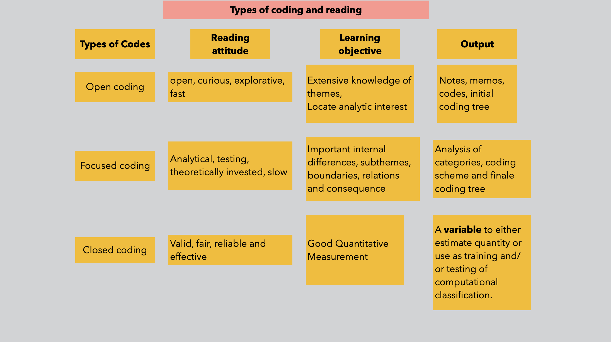

---

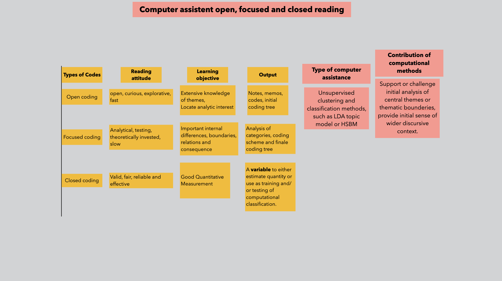

---

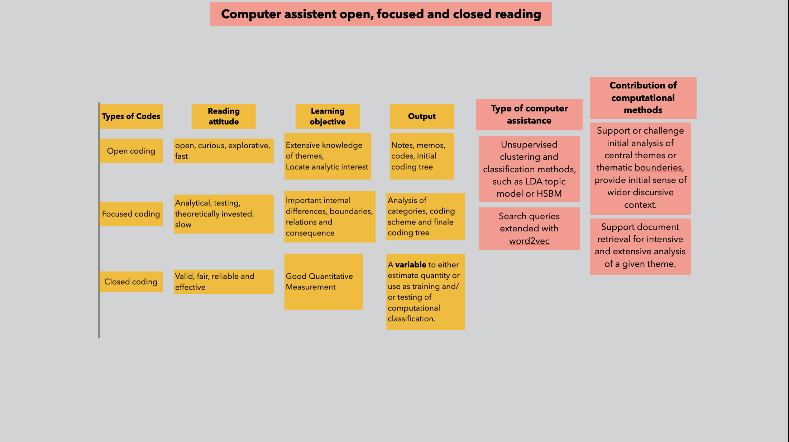

---

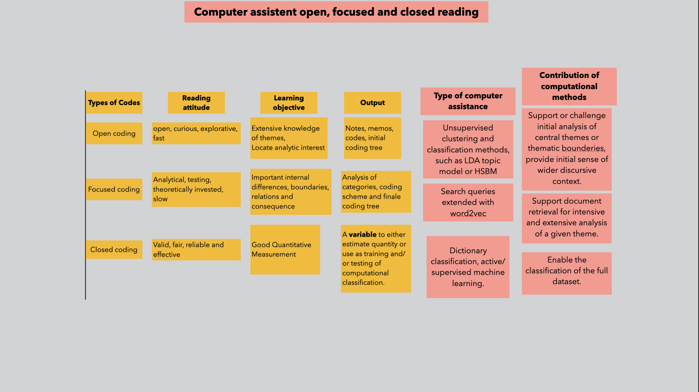

---

#### From finding to developing a focus

**Open coding**: trying out different perspective on different observations 

**Focused coding**: formulating, developing and testing a core analytical idea. 

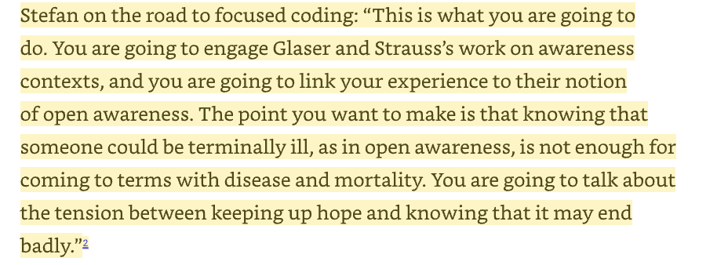

---

#### From finding to developing a focus 

1) Key theoretical/interpretative move = Open awareness context is not enough, add tension between hope and knowing it might end bad 

2) Developing a analysis of the tension between hope and the expectations of death.

--- 

#### From courious to critical reading

**Open coding reading**: playful and curious reading of different documents in the corpus

**Focused coding reading**: critical close reading of documents relevant to a certain theoretical idea. Coding for subcategories, axis of variation, defining analytical components. 

---

#### From exploratory to focused sampling of documents

**Open coding sampling**: explore different part of the corpus to find find interesting cases and learn about ones data site.

**Focus coding sampling**: sampling new documents further investigation of a category/analytic. Visiting variation to test and develop. 

---

#### What is the analytical focus that you will continue with from open coding?

---

#### Focusing with **index cases**

1) What are index cases: 
    - Excerpt that best capture or provoke a possible central theme in your study(page 92)
    - It is the point where you structure your variation around
    - It can the empirical material you use to illustrate your theme

2) Choose modular or edge cases

---
#### EXAMPLE: Frame disputes in refugee solidarity movement

---
#### EXAMPLE: Frame disputes in refugee solidarity movement
##### **Index cases**

Katrine: “Ukrainian refugees have been received with goodwill, a provisional law,and open arms. That is how it should be,in my opinion. However,refugees from other wars in the world have in the last couple of years been received with distrust, populist legislation, and closed doors, and that is unacceptable from our side.” 

Peter: “Those that come from Ukraine have a wish to come home as fast as possible. They are also in jobs quickly; they recognize our way of living in this country. They become a part of the society they live in. The others [Ed: foreigners] do not want to work. They just want. They do not recognize our way of living.”

Martin: “@Peter:What are you doing here? Long live racism.”

Dan: “@Martin: What are you doing here yourself.”

---
#### EXAMPLE: Frame disputes in refugee solidarity movement

**Focus 1**: What happens with a cycles of mobilization when the old and new cohort have very different issue and moral frames? 

**Focus 2**: How do frames dispute play out within a movement?

--- 
#### EXAMPLE: Frame disputes in refugee solidarity movement

1) The veteran cohort’s framing—the critique of the Ukraine privilege

2) The newcomer cohort’s framing: Justifying the differential treatment 

---
#### The veteran cohort’s framing—the critique of the Ukraine privilege

“*Today politicians voted for Apartheid in Denmark*” Veteran Activists 

 

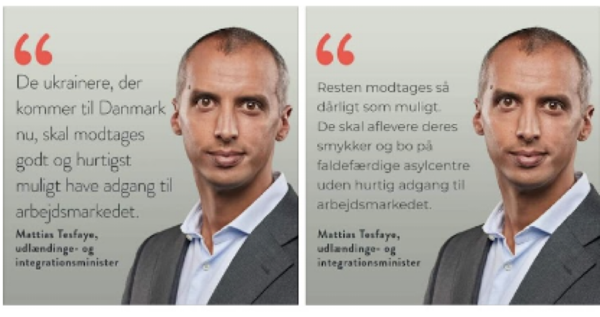

---
#### The veteran cohort’s framing—the critique of the Ukraine privilege
 

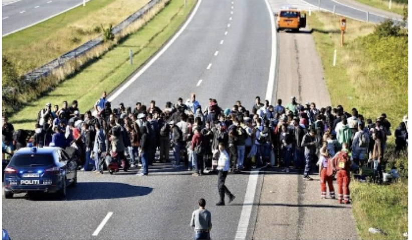

*“there are refugees who get a train ticket and are allowed to keep their wedding ring,and then there are refugees that have to deliver their wedding ring and walk on the motorway,”* Veteran Activists 

---
#### Justifying the differential treatment  

1) **Situational justification**:  *“if it was a civil war in Ukraine no one would help just as in Syrian”*

2) **Proximity justification**:  *“It is fine that people fled from the war back then[war in Syria]. But there are many regional countries that can help better locally. Just like we now do locally. That is why I call it neighborhood help”*

3) **Different type of refugee**: *“The Ukrainians show great gratitude and don’t want to be a burden. The other demanded and demanded and did not want to conform. They might now learn that it would help them to have another attitude”*

---
#### Major puzzle hit! 

1) Despite the very different frame we found very little frame disputes? 

2) **Revisit material**!
    - Most critiques of discrimination where articulated in groups veteran groups and not mixed groups.

    - The same individuals calling the provisional law racist outside the group setting would provide legal support around it inside the groups. 

--- 
#### Theoretical contribution

* Why so little frame dispute? 

* Compartmentalization! 

--- 

#### How to use computational methods for focus coding

1) Focus on one of a few categories. Expand keywords. Sample document to ensure **exposure** to the category. 

2) **Sample strategically** in order to **further theorizing** and developing **category**. 

3) Go into depth with **sub-categories**

4) **Complex search**: search two categories, for category and actor category, search in specific time periods and/or settings.  

---

#### Classification, Measurement and Validation

---
#### Validation and measurement in Computational Grounded Theory

1) Topic models are **both** used of **discovery** and **measurement**

2) **Validation** typically happens through **inspection** of top **words and documents**

3) Sometimes indirect validation happens by correlating with other indicators of the same category. 

---

#### Assumptions

1) We can't or do not have to do direct validation like we do in supervised machine learning

2) Face-validity is enough to ensure against measurement error and model instability

3) Indirect validation is enough to ensure against measurement error and model instability

--- 

#### Measurement problems

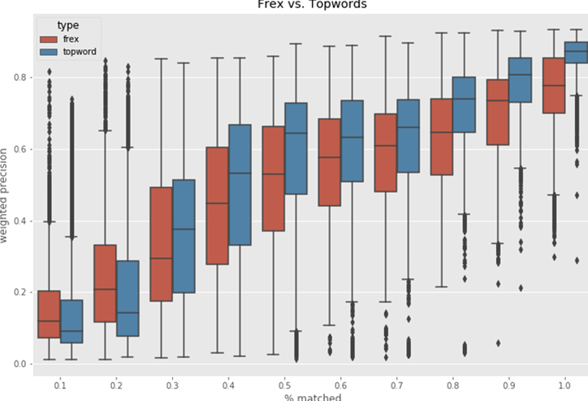

1) Top word inspection does not ensure against measurement error
2) Error is not random nor systematic
3) Measurement error can drive your results
4) Therefore we need direct validation 

---

#### Closed coding 

1) Uses a codebook to classify text.

2) Externalize implicit conception and knowledge

3) Analysis mode: Valid, fair, reliable and effective

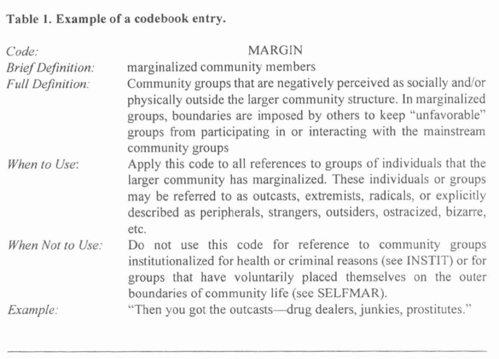

---

#### What makes a good code book

* Interpretatively valid grounded and qualified by extensive qualitative immersion

* Clear in its definition

* Clear in its application

---
#### Midway evaluation

1. Go to google sheet midway evaluation on absalon
2. In groups write down 2 positive and 2 things that could be improved(10 min)
3. Look over the other groups proposal and vote for 3 positive and 3 things to be improved.(vote with !)(5 min)
4. Discuss the points collectively

---

#### Next time: text classification and analysis

