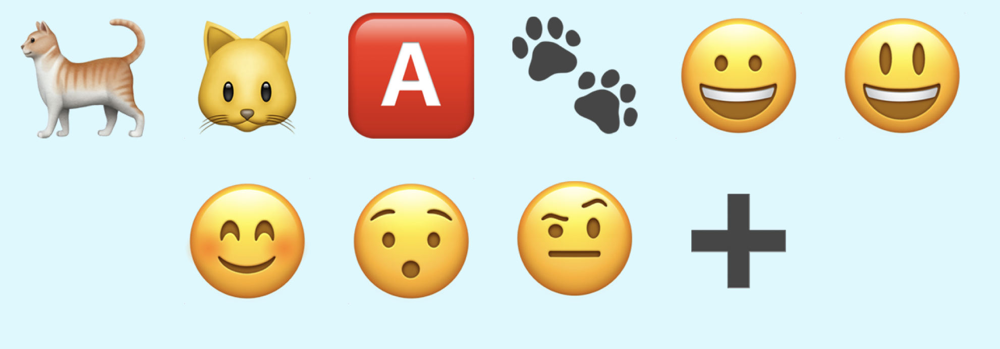
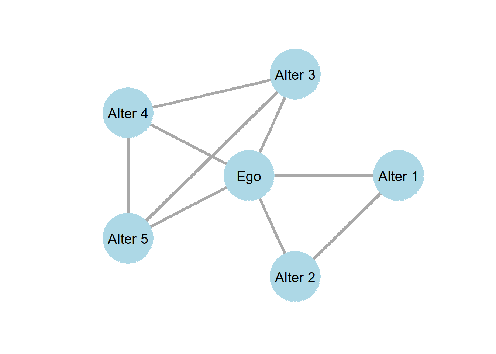
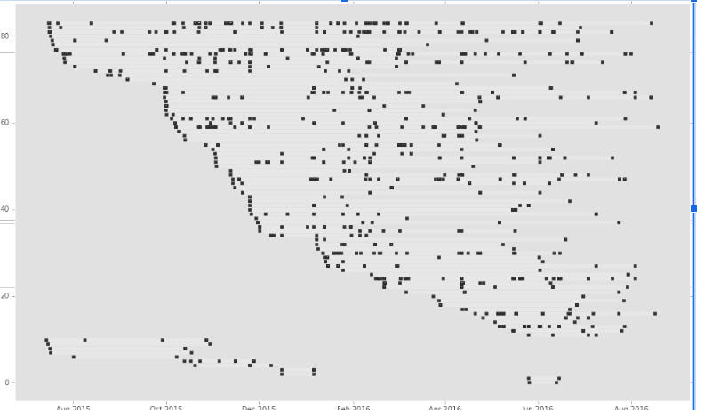

# Finding a topic, a research question and a datasite

### Digital methods lecture 2
 
 
 
 
    Course responsible: Hjalmar Bang Carlsen, Associate Professor SODAS. hc@sodas.ku.dk
 
---

## Today's tasks

1. Come up with topics
2. Come up research questions 
4. Find data sites

---

## Today's mood

Positive, Curious, Daring(and a bit practical) 

---

## Today's mood

Positive, Curious, Daring(and a bit practical) 

---
 
### What is a topic?

- Simply device a to concentrate your attention to some things and not others.

- We can use heuritics to change things around in order to see your topic in a new light

---

## Topics please!

---

### What is a topic?

- A broad theme 
- An event
- A group
- An activity
- An idea/discourse 
- A technology
- A location

---

### My topic as X

- A broad theme 
- An event
- A group
- An activity
- An idea/discourse 
- A technology
- A location

---

### Theoretical and Empirical casing

1. Some start with a very empirical topic and need think about conceptually
2. Some start with a very theoretical topic and need to think about empirically

---

### Casing: What is a topic a case of?

- Casing - from a empirical to a theoretical case
- Casing determines literature
- Casing opens up interesting questions

---
 
 
 
In groups take either your case or another case proposed and translate it into 2 or 3 different theoretical cases.

---

### Case selection: What is an good empirical case of my topic?

- Casing from theoretical to empirical case(case selection).
- In the universe of possible cases what is your case good and bad for.
- Case-selection has analytical consequences.

--- 

### Coming up with a Question
 

 

---

### Types of questions?
1. Theory testing questions
2. Theory generating questions
3. Descriptive questions
4. Casual questions

---

---
### Questions and quant/qual
  

- **Qualitative analysis can be causal AND theory testing**

---
### Questions and quant/qual
  

- Qualitative analysis can be causal AND theory testing

- **Quantitative analysis can be descriptive AND exploratory** 

---
### Exploiting Digital Data and Mixed methods for productive questions
 
 

1. **New data for testing "old" theories** 

"[J]ust as the invention of the telescope revolutionized the study of the heavens, so too by rendering the 
unmeasurable measurable, the technological revolution in mobile, Web, and Internet communications has the potential to revolutionize our understanding of ourselves and how we interact" (Watts 2012)

---
### Exploiting Digital Data and Mixed methods for productive questions
 
 

1. New data for testing old theories 
 
2. **New data for theory generation**

"induced data structures can surprise, challenging presumptions or pre-existing theory, and lead the social analyst to abductively generate new theory by imagining what would be socially required for those patterns to exist"(Evans and Aceves 2016).

---
### Exploiting Digital Data and Mixed methods for productive questions
 
 

1. New data for testing old theories 
 
2. New data for theory generation
 
3. **Mixed digital methods for theory testing**

MM approaches help address the uncertainties of testing theories old with digital data

---
### Exploiting Digital Data and Mixed methods for productive questions
 
 
 

1. New data for testing old theories 
2. New data for theory generation
3. Mixed digital methods for theory testing
4. **Mixed digital methods for theory generating**

MM approaches support the discovery and grounding of your theories. 

---

### Heuristics 

1. Methods for creative problem-solving and problem-generation

2. For exploiting mixed digital data and methods to say something interesting

3. Used through-out the research process

---
### Heuristics - Social Data Science *Data*

| Digital Data Quality | Heuristics                                                   |
|----------------------|--------------------------------------------------------------|
| Temporal data        | setting in motion                                            |
| Open text data       | reconceptualize, changing context, interpretative |
| Nested data          | changing levels, reconceptualize                              |
|Relational data| changing context, analogies|
| Big Data| spilting and lumping

---

### Heuristics - Social Data Science *methods*.

 
| Borrowing methods  | Possibility| Assumption | Challenge   |
|---|---|---|---|
| Topic modeling/word embedding| large-scale temporal analysis of culture| co-occurrence of words capture meaning| True? |
| Sentiment analysis | large-scale temporal individual emotional states  |  Social media message capture emotional states | True?  |
|  Network Analysis |  whole networks, contagion, comparative network analysis | interactions and relation online = social relations  | True?  |
---

**Challenging assumption and asking new questions**

1. What do we actually mean by something is a topic? When are you on or off topic? *Interpretative heuristic*
2. How do we use emotional words in public? *Constructivist heuristic*
3. What are the temporal patterns of relations on social media? *Setting in motion heuristic*  

---

---

---

### Some examples of Heuristics 

1. Changing levels 

From social movement **organization** frames to patterns of groups **interaction**

---

### Some examples of Heuristics 

1. Changing levels 

From  **organization** culture to **interaction** culture

2. Reversal

From **Support** Networks to **Demand** Networks

---

### Some examples of Heuristics 

1. Changing levels 

From  **organization** culture to **interaction** culture

2. Reversal

From **Support** Networks to **Demand** Networks

3. Reconceptualizing

a. from deservingness **jugdements** to **practices**
b. **passive** public opinion to **mobilized** public opinion

---

---

 
 
 
In groups discuss: 

a) Heuritcs moves you could make in your project to challenge the dominate way of thinking about your topic?

b) Try heuritcs out on your case in order to see what perspectives it enables.

 
---

### From topic to datasite(s)

---
### Investigation process
 
 
1. **Simplification**: translate research question/topic into search terms, and then

2. **Search operations** that return options for further explorations, that require

3. **scouting operations** that provide initials observations on potentials datasites. 

4. **Evaluation** and **selection** of datasite to become a part of the study. 

4. **Collect** data form the datasite  

---

### **Simplification and Search**

Do not just put things into a search engine, think about how you can find a lead.  

1. **Topical Words --> sites --> actors**
2. Follow Topical Actors --> words --> sites  
3. Topical Platfoms/places --> words --> actors 

---

### **Simplification and Search**

Do not just put things into a search engine, think about how you can find a lead.  

1. Topical Words --> sites --> actors
2. **Follow Topical Actors --> words --> sites**  
3. Topical Platfoms/places --> words --> actors 

---

### **Simplification and Search**

Do not just put things into a search engine, think about how you can find a lead.  

1. Topical Words --> sites --> actors
2. Follow Topical Actors --> words --> sites  
3. **Topical platfoms/places --> words --> actors** 

---

### (Topical platfoms) Facebook as a database of Danish informal civil society

1. Device search term list for civil society focus
2. Search
3. Scout/read group names and descriptions
4. Update Search terms(return to step 1)

---
### Milestone 1

- Description and justification of research topic and question 
- Description and justification for central datasite(s)

(assignment 1, 1-2 pages – hand in to teacher team 24/4 at 12.00)

---
**Exercise rooms**

CSS 2-1-24	Møller, Anna Helene Kvist

CSS 2-1-55  Schischkin, Michael

CSS 2-2-55	Schana, Philipp

---
 
 

### Next time: critically evaluate and select datasites

---
